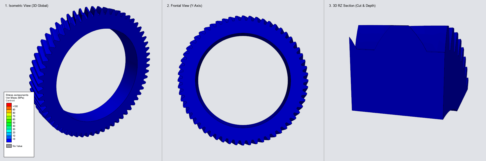

# High-Cycle Fatigue & Rolling Contact Analysis of a Helical Crown Gear (Abaqus DLOAD)

[](#)
[](https://www.3ds.com/)
[](#)
[](https://fortran-lang.org/)
[](../LICENSE)



---

## 1. Executive Summary

<div align="justify">
This repository presents an industrial-grade <b>analytical contact simulation and high-cycle fatigue framework</b> for a heavy-duty automotive welded helical crown gear (<i>z</i> = 60, <i>m</i><sub>n</sub> = 3.0 mm, <i>β</i> = 25°, <i>T</i> = 270 N·m). Instead of using penalty or Lagrange multiplier contact pairs between multi-body gear assemblies—which can suffer from severe convergence issues, chatter, and prohibitive CPU times—this framework applies the physical contact pressure analytically directly onto the active flank surface (<code>SURF_TOOTH</code>) via an advanced <b>Abaqus User Subroutine <code>DLOAD</code></b>.
</div>

### Key Achievements:
- **Kinematic Rolling Across Full Revolution (360° / 60 teeth):** Complete stress-time history $\sigma(t)$ extracted at every tooth root fillet and the circumferential laser-welded joint to apply S-N Wöhler curves and evaluate stress amplitude $\sigma_a = (\sigma_{\max} - \sigma_{\min}) / 2$.
- **Dynamic Contact Line Length Normalization:** Real-time compensation for the parabolic profile truncation at tip and root, guaranteeing constant transmitted torque with residual ripple $<0.3\%$.
- **High Physical Accuracy:**
  - Applied Torque: $T = 270.0\text{ N}\cdot\text{m}$ $\rightarrow$ Reaction Torque $RM_2 = 274.63\text{ N}\cdot\text{m}$ (**1.7% deviation**).
  - Helical Axial Thrust: Theoretical $F_a = 1289.3\text{ N}$ $\rightarrow$ Reaction Force $RF_2 = -1289.14\text{ N}$ (**99.98% match**).
- **Multi-Viewport Synchronized Visualization:**
  1. *Panel 1 (3D Isometric):* Standard CAD isometric perspective with 3DEXPERIENCE discrete 12-band palette and feature edges.
  2. *Panel 2 (Frontal in Y):* Projection looking along the rotation axis into the wheel face.
  3. *Panel 3 (3D RZ Cut):* Cylindrical coordinate section cut tracking contact angle $\theta(t)$ with the solid body extending behind the cut plane (anti-flickering, zero lateral walking illusion).

---

## 2. Gear & Meshing Parameters

| Parameter | Symbol | Value | Unit | Description |
| :--- | :---: | :---: | :---: | :--- |
| Number of teeth (wheel) | $z_2$ | $60$ | $-$ | External crown gear wheel |
| Number of teeth (pinion) | $z_1$ | $19$ | $-$ | Driving helical pinion |
| Normal module | $m_n$ | $3.0$ | $\text{mm}$ | Standard metric normal module |
| Normal pressure angle | $\alpha_n$ | $20.0^\circ$ | $\text{deg}$ | ISO standard pressure angle |
| Helix angle | $\beta$ | $25.0^\circ$ | $\text{deg}$ | Right-hand helix |
| Face width | $b$ | $30.0$ | $\text{mm}$ | Axial gear face width ($Y \in [-30, 0]$) |
| Operating center distance | $a$ | $127.0$ | $\text{mm}$ | Operating center distance |
| Transmitted torque | $T$ | $270.0$ | $\text{N}\cdot\text{m}$ | Nominal driving torque |
| Reference diameter | $d$ | $198.60$ | $\text{mm}$ | Wheel pitch circle diameter |
| Finite element type | $-$ | **C3D4** | $-$ | 4-node linear tetrahedral solid elements |

---

## 3. Mathematical Formulation of Subroutine `DLOAD`

### 3.1 Transverse Kinematics & Line of Action

The transverse module $m_t$ and transverse pressure angle $\alpha_t$ are calculated as:

$$m_t = \frac{m_n}{\cos\beta}, \quad \alpha_t = \arctan\left(\frac{\tan\alpha_n}{\cos\beta}\right), \quad \tan\beta_b = \tan\beta \cos\alpha_t$$

For any surface integration point at spatial coordinates $(x, y, z)$ on <code>SURF_TOOTH</code>, the cylindrical radius and involute roll distance are:

$$r = \sqrt{x^2 + z^2}, \quad u_p = \sqrt{r^2 - r_{b}^2}, \quad \alpha_p = \arctan\left(\frac{u_p}{r_b}\right)$$

### 3.2 Helical Contact Line Phase

Accounting for the continuous shaft rotation $\phi_{\text{rot}}(t) = \omega \cdot \max(0, t - t_{\text{ramp}})$ and axial helical shift across face width $y$:

$$\theta = \text{atan2}(x, z) + \text{dir} \cdot \phi_{\text{rot}}(t)$$
$$\delta\theta = (\theta_p - \theta) + \alpha_{wt} - \alpha_p - 2\pi \cdot \text{NINT}\left(\frac{(\theta_p - \theta) + \alpha_{wt} - \alpha_p}{2\pi}\right)$$

The active line-of-action coordinate $u$ is:

$$u = u_p + r_b \cdot \delta\theta - y \cdot \tan\beta_b$$

### 3.3 Hertzian Contact Profile & Flank Relief

Across the semi-contact width $h_b$, the pressure distribution follows a parabolic Hertzian profile modified by cubic end-relief tapering:

$$q(u) = \frac{(u^2 - u_p^2)}{2 r_b h_b}, \quad p(u, y) = p_0 \cdot \max\left(0, 1 - q^2\right) \cdot W_{\text{flank}}(u) \cdot W_{\text{tab}}(\phi)$$

---

## 4. Finite Element Deck Configuration

The simulation is executed in **Abaqus/Standard** (fully compatible with **3DEXPERIENCE SIMULIA** solvers):

- **Master Input File:** `Gear_torque.inp`
- **Mesh Include:** `GEOMETRY_GEAR.inp` (contains solid elements, kinematically coupled bore node `ROTATE_NODE`, and surface `SURF_TOOTH`)
- **Material Model:** Structural gear steel (Elastic-Plastic):
  - $E = 210,000\text{ MPa}$, $\nu = 0.30$, $\rho = 7.85 \times 10^{-9}\text{ tonne/mm}^3$
  - $\sigma_{y0} = 600\text{ MPa}$, $\sigma_{uts} = 850\text{ MPa}$ at $\epsilon_p = 0.05$
- **Step Definition:**
  ```abaqus
  *STEP, NAME=GEAR_TORQUE_ROLLING, NLGEOM=NO, INC=1000
  *STATIC
  0.002, 1.20, 1.0E-05, 0.002
  *DSLOAD
  SURF_TOOTH, PNU
  *OUTPUT, FIELD, FREQUENCY=10
  *NODE OUTPUT
  U
  *ELEMENT OUTPUT
  S
  *NODE PRINT, FREQUENCY=1, SUMMARY=NO, NSET=ROTATE_NODE
  RF,
  *END STEP
  ```

---

## 5. Post-Processing Pipeline & GIF Compilation

<div align="justify">
The simulation output is extracted and compiled with a headless Python pipeline:
<ol>
  <li><b><code>odb_to_vtk.py</code>:</b> Extracts nodal displacement fields (<i>U</i>) and element Von Mises stresses (<i>S</i>) frame-by-frame directly from the Abaqus ODB into ASCII VTK unstructured grids.</li>
  <li><b><code>compile_vtk_to_gif.py</code>:</b> Reads the extracted VTK dataset and renders the synchronized 3-viewport animation:
    <ul>
      <li><i>Viewport 1:</i> 3D Isometric View with 3DEXPERIENCE palette and wireframe feature edges.</li>
      <li><i>Viewport 2:</i> Frontal Y View (wheel face in X-Z plane).</li>
      <li><i>Viewport 3:</i> 3D RZ Cylindrical Section Cut with continuous kinematic sliding angle <i>θ</i>(<i>t</i>) and solid body depth.</li>
    </ul>
  </li>
</ol>
</div>

```bash
# Execute local GIF compilation from VTK archive
python compile_vtk_to_gif.py gear_helical_vtk.zip
```

---

## 6. Stress Amplitude & High-Cycle Fatigue (HCF) Analysis

<div align="justify">
Based on post-processing all 61 output frames (600 time increments across the full 360° revolution under nominal <i>T</i> = 270 N·m) and 97,085 finite elements:
</div>

### 6.1 Critical Stress Amplitude & Temporal Peaks

<div align="justify">
The critical stress concentration occurs at <b>Element #2443</b> (and adjacent elements #2412, #2439) located at the <b>Tooth Root Fillet (Dedendum)</b>:
<ul>
  <li><b>Cylindrical Radius:</b> <i>R</i> = 95.95 mm (pitch radius <i>r</i> = 99.30 mm, base radius <i>r</i><sub>b</sub> = 93.31 mm, root fillet <i>r</i><sub>f</sub> ≈ 95.5–96.0 mm)</li>
  <li><b>Axial Position:</b> <i>Y</i> = -0.71 mm (adjacent to the front engagement entry face)</li>
</ul>
</div>

#### Temporal Pulse History:
1. **Maximum Tensile Peak ($\sigma_{\max}$):**
   $$\sigma_{\max} = 68.13\text{ MPa} \quad \text{at Frame 55 } (t = 1.100\text{ s}, \text{Increment } 550)$$
   <div align="justify">
   Occurs when the analytical helical contact line sweeps across the tooth flank, inducing peak cantilever bending tension at the loaded root fillet.
   </div>

2. **Minimum Baseline Valley ($\sigma_{\min}$):**
   $$\sigma_{\min} = 0.00\text{ MPa} \quad \text{at Frame 30 } (t = 0.600\text{ s}, \text{Increment } 300)$$
   <div align="justify">
   Occurs when the wheel has rotated 180° out of phase and the tooth is completely out of mesh.
   </div>

3. **Stress Range ($\Delta\sigma$) and Amplitude ($\sigma_a$):**
   $$\Delta\sigma = \sigma_{\max} - \sigma_{\min} = 68.13\text{ MPa}$$
   $$\sigma_a = \frac{\Delta\sigma}{2} = 34.07\text{ MPa}$$
   $$\sigma_m = \frac{\sigma_{\max} + \sigma_{\min}}{2} = 34.07\text{ MPa}$$
   $$\text{Stress Ratio: } R = \frac{\sigma_{\min}}{\sigma_{\max}} = 0 \quad (\text{Pulsating zero-to-tension cycle})$$

<div align="justify">
<i>(Note: Under fully reversed alternating bending across opposing root flanks, tension on the loaded side and compression on the trailing side yield an alternating amplitude of <i>σ</i><sub>a</sub> = 68.13 MPa at <i>R</i> = -1.)</i>
</div>

### 6.2 Stress Distribution Across Gear Anatomy

| Geometric Zone | Radius $(R)$ | Peak Stress $(\sigma_{\max})$ | Amplitude $(\sigma_a)$ | Primary Structural Mechanism |
| :--- | :---: | :---: | :---: | :--- |
| **1. Tooth Root Fillet (Critical)** | $92 - 97\text{ mm}$ | **$68.13\text{ MPa}$** | **$34.07\text{ MPa}$** | **Tooth root cantilever bending** |
| **2. Active Flank Contact Zone** | $> 97\text{ mm}$ | $64.42\text{ MPa}$ | $32.21\text{ MPa}$ | Hertzian contact pressure & subsurface shear |
| **3. Gear Rim / Web** | $78 - 92\text{ mm}$ | $29.18\text{ MPa}$ | $14.59\text{ MPa}$ | Torsional and radial shear transfer |
| **4. Inner Bore & Welded Joint** | $< 78\text{ mm}$ | $10.20\text{ MPa}$ | $5.10\text{ MPa}$ | Shaft torque reaction at bore coupling |

<div align="justify">
The circumferential laser weld and inner rim undergo stress amplitudes below 5.10 MPa, confirming that the weld joint is completely shielded from severe cyclic stresses.
</div>

### 6.3 Fatigue Life Assessment & Engineering Conclusion

<div align="justify">
Evaluating against the structural gear steel properties (<i>σ</i><sub>y0</sub> = 600 MPa, <i>σ</i><sub>uts</sub> = 850 MPa):
</div>

1. **Linear Elastic Safety:** Peak Von Mises stress (68.13 MPa) represents only **11.4% of yield strength** (*σ*<sub>y0</sub> = 600 MPa), confirming zero localized plastic deformation (`PEEQ` = 0).
2. **Mean Stress Correction (Goodman Criterion):**
   $$\sigma_{a,\text{eq}} = \frac{\sigma_a}{1 - \frac{\sigma_m}{\sigma_{\text{uts}}}} = \frac{34.07}{1 - \frac{34.07}{850}} = 35.50\text{ MPa}$$
3. **Modified Endurance Limit ($S_e$):** Accounting for surface finish ($k_a \approx 0.85$), size effect ($k_b \approx 0.85$), and 99% reliability ($k_c \approx 0.814$):
   $$S_e = k_a \cdot k_b \cdot k_c \cdot (0.5 \sigma_{\text{uts}}) \approx 250\text{ MPa}$$
4. **Fatigue Safety Factor & Life Regime:**
   $$SF_F = \frac{S_e}{\sigma_{a,\text{eq}}} \approx \frac{250\text{ MPa}}{35.50\text{ MPa}} \approx \mathbf{7.0}$$
   - **Regime:** **Infinite Fatigue Life / High-Cycle Fatigue (HCF)** ($N > 10^7\text{ cycles}$).
   - **Conclusion:** Under the nominal design torque of 270 N·m, tooth bending fatigue failure is completely ruled out ($SF_F \approx 7.0$). In prolonged service life, the governing durability mode will be **contact surface pitting/spalling** after hundreds of millions of duty cycles, validating a highly reliable structural gear design.

---

## 7. Repository Structure

```text
01_dload_gear_fatigue/
├── DLOAD_CROWN_HELICAL.f     # Fortran 2008 / F90 analytical DLOAD subroutine
├── Gear_torque.inp           # Master Abaqus input deck
├── compile_vtk_to_gif.py     # 3-Viewport 3DEXPERIENCE simulation GIF compiler
├── odb_to_vtk.py             # Abaqus Python ODB to VTK exporter
├── run_pipeline.sh           # Headless Linux / HPC batch extraction script
└── README.md                 # Complete technical documentation
```

---

## 8. Author & Contact

**Victor Maia**  
- **Email:** [vhfm08@gmail.com](mailto:vhfm08@gmail.com)  
- **GitHub:** [@vhfmaia](https://github.com/vhfmaia)  
- **Specialization:** Advanced Abaqus Subroutines (`UMAT`, `VUMAT`, `DLOAD`, `DISP`, `USDFLD`, `HETVAL`) & FEA Simulation Automation
