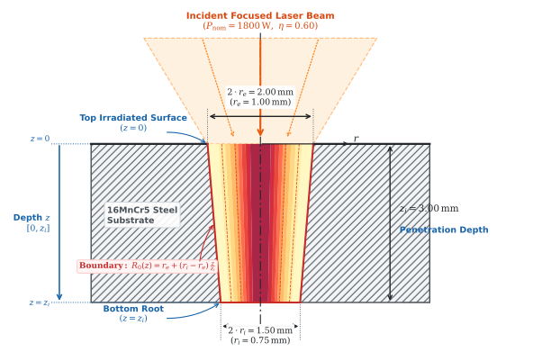

# Circumferential Laser Welding: Sequentially Coupled Thermo-Mechanical FEA & Phase Transformations

[](https://www.3ds.com/products-services/simulia/products/abaqus/)
[](https://www.3ds.com/)
[](https://en.wikipedia.org/wiki/Fortran)
[](https://www.python.org/)
[](../LICENSE)

An industrial-grade finite element analysis (FEA) framework simulating **circumferential laser welding** of an axisymmetric powertrain assembly (shaft-to-hub cylindrical press-fit joint) using Abaqus/Standard and SIMULIA 3DEXPERIENCE.

The project implements a **sequentially coupled thermo-mechanical analysis**:
1. **Thermal Stage (`Disk_heatsource_TH.inp`):** Solves transient 3D heat conduction using user subroutine `dflux_disk_conical_gaussian.f` (moving conical Gaussian volumetric heat source with angular power scheduling) coupled to metallurgical phase transformation kinetics (`Material_16MnCr5.inp`) in 16MnCr5 case-hardening gear steel.
2. **Mechanical Stage (`Disk_heatsource_ME.inp`):** Sequentially imports transient nodal temperatures (`*TEMPERATURE, FILE=Disk_heatsource_TH`), calculating thermal distortions, high-temperature plastic yielding, continuous annealing at $1500^\circ\text{C}$, and final locked-in residual stress states on a hybrid formulation mesh (`Geometry_ME.inp`, `C3D8H`).
3. **Automated Post-Processing Pipeline:** Includes batch scripts (`run_pipeline.sh`, `odb_to_vtk.py`, `compile_vtk_to_gif.py`) extracting `.odb` results into VTK unstructured grids and compiling multi-viewport animated GIF visual reports.

---

## 1. Physics & Mathematical Formulation

### 1.1 Conical Gaussian Heat Source ($q(r, z)$)

The laser volumetric heat flux is formulated in a local cylindrical frame tracking the instantaneous position of the beam axis:

$$q(r, z) = Q_0 \cdot \exp\left( -3 \frac{r^2}{R_0(z)^2} \right)$$

where:
- $r = \sqrt{(X - X_c)^2 + (Y - Y_c)^2}$ is the radial distance from the beam focal center in the horizontal plane.
- $z$ is the depth measured from the top irradiated joint surface ($z = Z_0 - Z_{\text{coord}}$, with $0 \le z \le z_i$).
- $R_0(z)$ is the local conical beam radius at depth $z$, interpolating linearly between top surface radius $r_e$ and root radius $r_i$:

$$R_0(z) = r_e + (r_i - r_e) \frac{z}{z_i}$$

<p align="center">
  
</p>

### 1.2 Analytical Volume Energy Conservation (Farrokhi et al. / Wu et al. TDC Model)

To guarantee that the integrated thermal power inside the conical envelope ($r \le R_0(z)$, $0 \le z \le z_i$) strictly equals the absorbed laser power ($P_{\text{abs}} = \eta \cdot Q_{\text{tot}}$), the peak flux $Q_0$ is derived analytically by integrating the Three-Dimensional Conical (TDC) Gaussian distribution:

$$\int_V q(r, z) \, dV = \int_0^{z_i} \left[ \int_0^{R_0(z)} Q_0 \exp\left( -3 \frac{r^2}{R_0(z)^2} \right) 2\pi r \, dr \right] dz$$

Evaluating the radial Gaussian integral up to the cone boundary $r = R_0(z)$:

$$\int_0^{R_0(z)} \exp\left( -3 \frac{r^2}{R_0(z)^2} \right) 2\pi r \, dr = \frac{\pi R_0(z)^2}{3} \left( 1 - e^{-3} \right) = \frac{\pi R_0(z)^2}{3} \cdot \frac{e^3 - 1}{e^3}$$

Integrating along the conical penetration depth $z \in [0, z_i]$:

$$\int_0^{z_i} R_0(z)^2 \, dz = \int_0^{z_i} \left[ r_e + (r_i - r_e) \frac{z}{z_i} \right]^2 dz = \frac{z_i}{3} \left( r_e^2 + r_e r_i + r_i^2 \right)$$

Combining terms and equating to the absorbed beam power $\eta \cdot Q_{\text{tot}}$ yields the exact analytical prefactor (Farrokhi et al. 2019, Wu et al. 2006, Liu et al. 2022):

$$Q_0 = \frac{9 \, \eta Q_{\text{tot}} \, e^3}{\pi (e^3 - 1) z_i \left( r_e^2 + r_e r_i + r_i^2 \right)}$$

For nominal parameters ($P_l = 1800\text{ W}$, $\eta = 0.60 \implies P_{\text{abs}} = 1080\text{ W}$, $r_e = 1.0\text{ mm}$, $r_i = 0.75\text{ mm}$, and $z_i = 3.0\text{ mm}$), the analytical peak core flux is $Q_0 = 4.6935 \times 10^5\text{ mW/mm}^3$ ($469.35\text{ W/mm}^3$).

<p align="center">
  
</p>

### 1.3 Kinematics & Angular Power Schedule

The beam revolves along the circular joint interface ($R = 15.0\text{ mm}$) at linear travel speed $v = 20.0\text{ mm/s}$ ($1200\text{ mm/min}$):

$$\omega = \frac{v}{R} = 1.3333\text{ rad/s}, \qquad \theta(t) = \omega \cdot t$$
$$X_c(t) = R \cos(\theta), \qquad Y_c(t) = R \sin(\theta)$$

To prevent hot-cracking, initial thermal shock, and keyhole collapse defects at weld termination, the subroutine applies a continuous 3-stage angular power schedule:

| Segment | Angular Domain | Physical Time | Power Amplitude $\text{AMP}(\theta)$ | Purpose |
| :--- | :---: | :---: | :---: | :--- |
| **1. Ramp-Up** | $0^\circ \le \theta < 10^\circ$ | $0.000 \to 0.131\text{ s}$ | $\theta / 10^\circ$ (Linear) | Smooth keyhole initiation |
| **2. Steady Weld** | $10^\circ \le \theta \le 370^\circ$ | $0.131 \to 4.843\text{ s}$ | $1.000$ ($1080\text{ W}$ absorbed) | Full $360^\circ$ circumferential joint weld |
| **3. Ramp-Down Overlap** | $370^\circ < \theta \le 380^\circ$ | $4.843 \to 4.974\text{ s}$ | $1.0 - (\theta - 370^\circ)/10^\circ$ | Crater filling & hot-crack mitigation |
| **4. Beam Off** | $\theta > 380^\circ$ | $4.974 \to 6.000\text{ s}$ | $0.000$ | Solidification & initial cooling |

Total beam active time is $t_{\text{beam}} = 4.974\text{ s}$, transferring $E_{\text{net}} = 5,236\text{ J}$ ($261.8\text{ J/mm}$ heat input along the joint circumference).

---

## 2. Material Architecture & Phase Transformation Engine (`Material_16MnCr5.inp`)

### 2.1 Unified Material Card Strategy

In industrial finite element modeling, keeping a single material file (`Material_16MnCr5.inp`) shared by both thermal and mechanical simulations guarantees data consistency and prevents property mismatch:
- **Thermal Step (`Disk_heatsource_TH.inp`):** Solves the energy conservation equation. Abaqus reads the thermo-physical properties (`*CONDUCTIVITY`, `*SPECIFIC HEAT`, `*LATENT HEAT`, `*DENSITY`) and evaluates the built-in phase transformation tables (`*PARAMETER TABLE`, `*PROPERTY TABLE`), ignoring elastic and plastic cards.
- **Mechanical Step (`Disk_heatsource_ME.inp`):** Solves momentum balance. Abaqus reads the constitutive mechanical properties (`*ELASTIC`, `*EXPANSION`, `*PLASTIC`, `*ANNEAL TEMPERATURE`, `*DENSITY`), ignoring thermal conductivity and heat capacity.

Both input decks reference the identical material identifier:
```inp
*SOLID SECTION, ELSET=SHAFT_SECTION, MATERIAL="16MnCr5"
*SOLID SECTION, ELSET=HUB_SECTION, MATERIAL="16MnCr5"
```

### 2.2 Built-in Phase Transformation Kinetics (`ABQ_PHASE_TRANS`)

Rather than relying on external user subroutines (`HETVAL` or `USDFLD`), the thermal model leverages the built-in Abaqus metallurgical engine via constitutive parameter tables and solution-dependent state variables (`*DEPVAR`):

```
+-----------------------------------------------------------------------------------------+
|                    SOLUTION-DEPENDENT STATE VARIABLES (SDV1 - SDV7)                     |
+-----------------------------------------------------------------------------------------+
| SDV1: RLS              --> Remaining Liquid Solidification fraction (1.0=Solid, 0.0=Liquid)
| SDV2: fGrainColumnar   --> Columnar vs Equiaxed grain morphology fraction
| SDV3: GrainSize        --> Prior austenite grain size evolution [µm]
| SDV4: fPhase_Ferrite   --> Ferrite + Pearlite fraction (initial condition = 1.0)
| SDV5: fPhase_Austenite --> High-temperature Austenite fraction
| SDV6: fPhase_Bainite   --> Intermediate Bainite fraction
| SDV7: fPhase_Martensite--> Hard Martensite fraction (quenched fusion zone / HAZ)
+-----------------------------------------------------------------------------------------+
```

#### Diffusional Phase Transformations (Austenite $\to$ Ferrite, Austenite $\to$ Bainite)
Governed by Johnson-Mehl-Avrami (JMA) isothermal transformation kinetics adapted to continuous cooling via the Scheil additivity rule:

$$f(t, T) = 1 - \exp\left( -k(T) \cdot t^{n(T)} \right)$$

where kinetic coefficients $k(T)$ and $n(T)$ are derived from the alloy's Time-Temperature-Transformation (TTT) diagrams between $Ac_1 = 734^\circ\text{C}$ and $Bs = 617^\circ\text{C}$ for ferrite, and between $Bs = 617^\circ\text{C}$ and $Ms = 425^\circ\text{C}$ for bainite.

#### Displacive Martensitic Transformation (Austenite $\to$ Martensite)
Below the martensite start temperature ($M_s = 425^\circ\text{C}$), diffusionless shear transformation is calculated via the Koistinen-Marburger (K-M) equation:

$$f_M = f_A \cdot \left[ 1 - \exp\left( -\gamma \cdot (M_s - T) \right) \right]$$

with empirical rate coefficient $\gamma = 0.011\text{ K}^{-1}$. The material card maps $5\%$ martensite at $420^\circ\text{C}$ and $90\%$ at $216^\circ\text{C}$.

#### Austenitization on Rapid Heating
During laser irradiation, rapid heating across the intercritical range ($Ac_1 = 734^\circ\text{C}$ to $Ac_3 = 840^\circ\text{C}$) dissolves existing ferrite/pearlite into austenite. Equilibrium parent phase fractions and TTT diagrams guarantee complete austenitization prior to melting.

#### Latent Heat of Fusion
The phase change energy is accounted for across the mushy zone ($T_{\text{solidus}} = 1490^\circ\text{C}$ to $T_{\text{liquidus}} = 1515^\circ\text{C}$):
```inp
*PARAMETER TABLE, TYPE="ABQ_PHASE_TRANS_MeltingTemperature"
 1490, 1515,
*LATENT HEAT
 2.700E+11, 1490, 1515, 1.0
```
where $L = 270\text{ kJ/kg}$ ($2.70 \times 10^{11}\text{ mJ/tonne}$).

### 2.3 Mechanical Constitutive Behavior & High-Temperature Annealing

- **Thermal Expansion:** Temperature-dependent secant thermal expansion coefficient $\alpha(T)$ ranging from $1.15 \times 10^{-5}\text{ K}^{-1}$ at $20^\circ\text{C}$ to $1.70 \times 10^{-5}\text{ K}^{-1}$ at $1500^\circ\text{C}$ (`ZERO=25.0`).
- **Degradation of Elastic Modulus:** Young's modulus drops monotonically from $210\text{ GPa}$ ($20^\circ\text{C}$) to $300\text{ MPa}$ ($1500^\circ\text{C}$); Poisson's ratio approaches the incompressibility limit ($\nu = 0.48$).
- **Temperature-Dependent Plasticity:** Yield strength decays from $550\text{ MPa}$ at room temperature to $1.5\text{ MPa}$ at $1500^\circ\text{C}$.
- **Plastic Strain Reset (`*ANNEAL TEMPERATURE`):**
  ```inp
  *ANNEAL TEMPERATURE
   1500.0
  ```
  Molten metal cannot store dislocation hardening. When an element exceeds $1500^\circ\text{C}$, Abaqus resets the equivalent plastic strain (`PEEQ = 0`), preventing artificial accumulated plastic distortion from corrupting the solid-state residual stress field during cool-down.

---

## 3. Sequentially Coupled Architecture

```
+-----------------------------------------------------------------------------------------+
|                                1. THERMAL ANALYSIS DECK                                 |
|                                                                                         |
|  Disk_heatsource_TH.inp <---+--- Geometry_TH.inp (DC3D8 Linear Hex Elements)            |
|                             +--- Material_16MnCr5.inp (k(T), cp(T), rho, Phase Trans)   |
|                             +--- dflux_disk_conical_gaussian.f (Conical Gaussian TDC)   |
|                                                                                         |
|  Step 1: Welding & Solidification (dt = 0.012 s, CFL <= 0.80)                           |
|  Step 2: Cooling to Ambient (DELTMX = 25 °C adaptive kinetics)                          |
+--------------------------------------------+--------------------------------------------+
                                             |
                                  Disk_heatsource_TH.odb
                                 (Nodal Temperatures NT11)
                                             |
                                             v
+--------------------------------------------+--------------------------------------------+
|                               2. MECHANICAL ANALYSIS DECK                               |
|                                                                                         |
|  Disk_heatsource_ME.inp <---+--- Geometry_ME.inp (C3D8H Hybrid Brick Elements, NSET_BASE)|
|                             +--- Material_16MnCr5.inp (E(T), nu(T), alpha(T), sigma_y)  |
|                             +--- *TEMPERATURE, FILE=Disk_heatsource_TH                  |
|                             +--- *ANNEAL TEMPERATURE = 1500.0 °C (Resets Molten PEEQ)    |
|                             +--- *DLOAD, GRAV (Hydrostatic Fluid Stabilization)         |
|                                                                                         |
|  Step 1: Transient Thermal Stress & Distortions (NLGEOM=YES, Line Search Controls)      |
|  Step 2: Post-Weld Cooling & Locked-In Residual Stress Field                            |
+--------------------------------------------+--------------------------------------------+
                                             |
                                  Disk_heatsource_ME.odb
                                             |
                                             v
+--------------------------------------------+--------------------------------------------+
|                          3. AUTOMATED POST-PROCESSING & REPORT                          |
|                                                                                         |
|  odb_to_vtk.py          -->  Extracts NT11, U, S (Von Mises), PEEQ to VTK ASCII         |
|  laser_*_vtk.zip        -->  Compacts frames for cloud HPC & archive portability        |
|  compile_vtk_to_gif.py  -->  Multi-viewport 3DEXPERIENCE simulation report GIF          |
+-----------------------------------------------------------------------------------------+
```

### 3.1 Numerical Stability: CFL Criterion

In moving-source thermal FEA, capturing the steep temperature gradients across the laser fusion line requires synchronizing circumferential element size with time incrementation:

$$C = \frac{v \cdot \Delta t}{\Delta h} \le 1.0$$

- Welding velocity: $v = 20.0\text{ mm/s}$.
- Circumferential element pitch: $\Delta h = 2\pi R / N_\theta = 2\pi(15.0)/312 \approx 0.302\text{ mm}$.
- CFL limit: $\Delta t_{\text{max}} = 0.302 / 20.0 = 0.0151\text{ s}$.

In `Disk_heatsource_TH.inp`, Step 1 enforces a fixed time increment $\Delta t = 0.012\text{ s}$, corresponding to a Courant number of $C = 0.80$. This ensures the Gaussian heat source smoothly traverses each element without artificial peak temperature oscillations or skipped nodes.

### 3.2 Mitigation of Volumetric Locking (`C3D8H` Hybrid Elements)

At temperatures near melting ($T > 1200^\circ\text{C}$) and in the plastic regime, steel behaves near-incompressibly ($\nu \to 0.5$). In standard first-order brick elements (`C3D8`), the kinematic incompressibility constraint causes severe **volumetric locking** across the steep thermal gradient of the fusion line, leading to negative Jacobians ($\det(J) \le 0$) and premature Newton-Raphson divergence.

**Engineering Solution:**
- `Geometry_ME.inp` converts all solid elements to **`C3D8H` (8-node linear brick, hybrid with constant pressure)**. Hydrostatic pressure is treated as an independently interpolated variable, eliminating volumetric locking.
- Body-force gravity loading (`*DLOAD, GRAV`) stabilizes the hydrostatic pressure field in molten regions.

---

## 4. Project File Structure

```text
02_dflux_laser_welding/
├── Disk_heatsource_TH.inp                 # Thermal master input deck (DC3D8, 2-step welding & cooling)
├── Disk_heatsource_ME.inp                 # Mechanical master input deck (C3D8H, sequentially coupled)
├── Geometry_TH.inp                        # Thermal mesh deck (DC3D8 heat transfer solid bricks)
├── Geometry_ME.inp                        # Mechanical mesh deck (C3D8H hybrid elements, NSET_BASE)
├── Material_16MnCr5.inp                   # Unified thermo-elasto-plastic & phase transformation deck
├── dflux_disk_conical_gaussian.f          # User subroutine (Modern Fortran 2008/90, TDC model)
├── compile_vtk_to_gif.py                  # Multi-viewport 3DEXPERIENCE simulation report compiler
├── compile_vtk_to_gid.py                  # Pipeline alias script
├── odb_to_vtk.py                          # Abaqus Python ODB to VTK ASCII exporter & ZIP packager
├── run_pipeline.sh                        # HPC / batch automated execution pipeline
├── conical_heat_source_improved_plot.svg  # 4-Panel 3D Conical Heat Source & Trajectory Plot (SVG)
└── README.md                              # Technical report & documentation
```

---

## 5. Execution Guide (Abaqus / 3DEXPERIENCE)

### Automated Pipeline Execution

Execute the entire decoupled workflow or individual stages via `run_pipeline.sh`:

```bash
# Run full decoupled pipeline (Thermal FEA -> Thermal VTK -> Mechanical FEA -> Mechanical VTK)
./run_pipeline.sh all

# Or run stage-by-stage:
./run_pipeline.sh therm      # Runs Disk_heatsource_TH.inp + dflux_disk_conical_gaussian.f
./run_pipeline.sh vtk_therm  # Exports laser_therm_vtk.zip
./run_pipeline.sh mech       # Runs Disk_heatsource_ME.inp
./run_pipeline.sh vtk_mech   # Exports laser_mech_vtk.zip
```

### Manual Command-Line Execution

#### 1. Thermal Analysis
```bash
abaqus job=Disk_heatsource_TH input=Disk_heatsource_TH.inp user=dflux_disk_conical_gaussian.f cpus=4 interactive
```

#### 2. Thermal Result Extraction (VTK ZIP)
```bash
abaqus python odb_to_vtk.py Disk_heatsource_TH.odb --prefix=laser_therm
```

#### 3. Mechanical Analysis (Importing Thermal History)
```bash
abaqus job=Disk_heatsource_ME input=Disk_heatsource_ME.inp cpus=4 interactive
```

#### 4. Mechanical Result Extraction (VTK ZIP)
```bash
abaqus python odb_to_vtk.py Disk_heatsource_ME.odb --prefix=laser_mech
```

#### 5. Generate Multi-Viewport Animated Visual Report
```bash
python compile_vtk_to_gif.py laser_mech_vtk.zip --fps 15 -o laser_welding_report.gif
```

---

## 6. Key Results to Evaluate

- **Melt Pool Geometry:** Isotherm $T \ge T_{\text{liquidus}} = 1515^\circ\text{C}$ identifies the molten weld bead width and penetration depth ($z_i \approx 3.0\text{ mm}$).
- **Heat Affected Zone (HAZ):** Region bounded between $Ac_1 = 734^\circ\text{C}$ and $T_{\text{solidus}} = 1490^\circ\text{C}$.
- **Phase Distributions (`SDV4`–`SDV7`):** Martensite formation in the rapidly cooled HAZ and bainite/ferrite in adjacent parent material.
- **Residual Stress State:** Peak hoop ($\sigma_{\theta\theta}$) and axial ($\sigma_{zz}$) tensile stresses locked along the weld fusion line, balanced by compressive stress in the surrounding shaft and hub body.

---

## 7. Standards & References

1. **Farrokhi, F., Endelt, B., & Kristiansen, M. (2019):** *A numerical model for full and partial penetration hybrid laser welding of thick-section steels*, Optics & Laser Technology, 109, 629–642.
2. **Wu, C. S., Wang, H. G., & Zhang, Y. M. (2006):** *A new heat source model for keyhole plasma arc welding in FEM analysis of the temperature profile*, Welding Journal, 85(12), 284–291.
3. **Liu, M., Kouadri-Henni, A., & Malard, B. (2022):** *Simulation of low-cycle fatigue residual stress in DP600 steel laser-welded structure*, 11th International Conference on Residual Stresses (ICRS11), Nancy, France.
4. **EN 1993-1-2:2005:** *Eurocode 3: Design of steel structures — Part 1-2: General rules — Structural fire design* (temperature-dependent thermal properties).
5. **EN 10084:** *Case hardening steels — Technical delivery conditions* (chemical composition of 16MnCr5).
6. **Andrews, K. W. (1965):** *Empirical formulae for the calculation of critical temperatures in steels*, Journal of the Iron and Steel Institute (JISI), 203, 721–727.
7. **Koistinen, D. P., & Marburger, R. E. (1959):** *A general equation prescribing the extent of the austenite-martensite transformation in pure iron-carbon alloys and plain carbon steels*, Acta Metallurgica, 7(1), 59–60.

---

## 8. Disclaimer

This repository is published for professional portfolio and academic demonstration purposes. All CAD dimensions, process parameters, and metallurgical kinetics presented herein are synthetic, open-literature benchmarks designed to illustrate advanced FEA and Fortran programming methodologies, and do not represent any confidential automotive powertrain production data.

---

## 9. Author & Contact

**Victor Maia**  
- **Email:** [vhfm08@gmail.com](mailto:vhfm08@gmail.com)  
- **GitHub:** [@vhfmaia](https://github.com/vhfmaia)  
- **Specialization:** Advanced Abaqus Subroutines (`UMAT`, `VUMAT`, `DLOAD`, `DFLUX`, `DISP`, `USDFLD`, `HETVAL`) & FEA Simulation Automation
