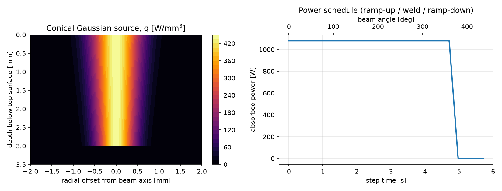

# FEA Thermal Simulation of Circumferential Laser Welding with Phase Transformations in Abaqus

[](https://www.3ds.com/products-services/simulia/products/abaqus/)
[](https://www.3ds.com/)
[](https://en.wikipedia.org/wiki/Fortran)
[](https://www.python.org/)
[](../LICENSE)

An end-to-end, benchmark-grade finite element analysis (FEA) framework for simulating **circumferential laser / electron-beam welding** of axisymmetric components (shaft-to-hub press/slip-fit joint). 

The package couples:
- A user subroutine (`DFLUX.for`) implementing a **moving conical Gaussian volumetric heat source** along a circular trajectory with power ramping.
- The built-in Abaqus **`ABQ_PHASE_TRANS` metallurgical framework** for tracking liquidus/solidus transitions, austenitisation, and solid-state decomposition (ferrite, bainite, martensite) in low-alloy case-hardening steel (16MnCr5).
- An Abaqus-free **verification and mesh-generation toolchain in Python** that guarantees energy conservation down to the element Gauss points prior to solver execution.

---

## 1. Physics & Mathematical Formulation

### 1.1 Conical Gaussian Heat Source

The volumetric heat flux $q(r, z)$ is defined in a local coordinate frame centred on the moving beam axis:

$$q(r, z) = Q_0 \cdot \exp\left( -3 \frac{r^2}{R_0(z)^2} \right)$$

where:
- $r = \sqrt{(X - X_c)^2 + (Y - Y_c)^2}$ is the radial distance from the beam centre in the horizontal plane.
- $z$ is the depth measured from the top irradiated surface ($z = Z_0 - Z_{\text{int}}$, with $0 \le z \le z_i$).
- $R_0(z)$ is the local beam radius at depth $z$, interpolating linearly between the surface radius $r_e$ and root radius $r_i$:

$$R_0(z) = r_e + (r_i - r_e) \frac{z}{z_i}$$

```
                Top surface (z = 0)
         |----------- 2 * r_e -----------|
         \                               /
          \                             /  |
           \                           /   | Depth z_i
            \                         /    |
             |------- 2 * r_i -------|     v
                 Bottom root (z = z_i)
```

### 1.2 Energy Conservation Proof

To ensure that the total integrated thermal power exactly matches the absorbed beam power $P_{\text{abs}} = \eta \cdot Q_{\text{tot}}$, the peak flux $Q_0$ is derived analytically by integrating over the conical volume:

$$\int_V q(r, z) \, dV = \int_0^{z_i} \left[ \int_0^\infty Q_0 \exp\left( -3 \frac{r^2}{R_0(z)^2} \right) 2\pi r \, dr \right] dz$$

Evaluating the radial Gaussian integral:

$$\int_0^\infty \exp\left( -3 \frac{r^2}{R_0(z)^2} \right) 2\pi r \, dr = \frac{\pi R_0(z)^2}{3}$$

Integrating along the penetration depth $z$:

$$\int_0^{z_i} \frac{\pi R_0(z)^2}{3} \, dz = \frac{\pi}{3} \int_0^{z_i} \left[ r_e + (r_i - r_e) \frac{z}{z_i} \right]^2 dz = \frac{\pi}{3} \cdot \frac{z_i}{3} \left( r_e^2 + r_e r_i + r_i^2 \right)$$

Equating to $\eta \cdot Q_{\text{tot}}$ yields the exact normalisation prefactor implemented in `DFLUX.for`:

$$Q_0 = \frac{3 \, \eta Q_{\text{tot}}}{\pi \cdot \frac{z_i}{3} \left( r_e^2 + r_e r_i + r_i^2 \right)}$$



### 1.3 Kinematics & Power Schedule

The heat source moves along a circular path of radius $R$ at linear travel speed $v$:

$$\omega = \frac{v}{R}, \qquad \theta(t) = \omega \cdot t$$
$$X_c(t) = R \cos(\theta), \qquad Y_c(t) = R \sin(\theta)$$

The effective power amplitude $\text{AMP}(\theta) \in [0, 1]$ accommodates multi-stage process cycles:
1. **Ramp-up** ($\theta < \theta_{\text{ramp,u}}$): linear power increase.
2. **Steady weld** ($\theta_{\text{ramp,u}} \le \theta < \theta_{\text{ramp,u}} + \theta_{\text{weld}}$): full nominal power ($\text{AMP} = 1.0$).
3. **Ramp-down / overlap** ($\theta \ge \theta_{\text{ramp,u}} + \theta_{\text{weld}}$): linear decay over $\theta_{\text{ramp,d}}$ to prevent crater cracking and keyhole collapse defects.

---

## 2. Metallurgy & BTR Evaluation

### 2.1 Abaqus Phase Transformation Framework (`ABQ_PHASE_TRANS`)

The thermal material card couples non-linear temperature-dependent thermophysical properties ($k, c_p, \rho$) with metallurgical state variables (`SDV`):

| Variable | Physical Meaning | Initial Value |
| :--- | :--- | :--- |
| **`SDV1` (RLS)** | Raw-Liquid-Solid state flag | `1.0` (Solid) |
| **`SDV4`** | Ferrite-Pearlite phase fraction | `1.0` (Initial base metal) |
| **`SDV5`** | Austenite phase fraction | `0.0` |
| **`SDV6`** | Bainite phase fraction | `0.0` |
| **`SDV7`** | Martensite phase fraction | `0.0` |

*Note on RLS:* In the `ABQ_PHASE_TRANS` architecture (initially engineered for powder-bed AM), `RLS = -1.0` denotes unmolten raw powder, `0.0` represents the liquid melt pool, and `1.0` represents consolidated solid material. For forging/machined steel joints, the initial state is set to `RLS = 1.0`.

### 2.2 Solidification & BTR Tracking

A critical design choice in `GLOBAL_THERM.inp` is the two-step thermal strategy:

1. **Step 1 (`WELDING_STEP_THERMAL`):**
   - Covers active beam irradiation ($t = 0 \to 4.97\text{ s}$) and extends up to $t = 6.00\text{ s}$.
   - Uses a **strictly constrained, small time increment ($\Delta t = 0.012\text{ s}$)** with `DELTMX = 5000.0`.
   - **Engineering rationale:** This prevents the automatic time stepper from jumping forward immediately when the beam shuts down, preserving high temporal resolution through the **Brittleness Temperature Range (BTR)** ($T_{\text{solidus}} \le T \le T_{\text{liquidus}}$) to capture cooling rates, thermal gradients, and hot-cracking susceptibility criteria.
2. **Step 2 (`COOLING_STEP_THERMAL`):**
   - Transits to automatic adaptive incrementation governed by `DELTMX = 25.0 °C` to compute solid-state diffusional (JMA) and martensitic (Koistinen-Marburger) transformations down to ambient temperature without unnecessary computational cost.

### 2.3 Numerical Stability & Courant-Friedrichs-Lewy (CFL) Criterion

In moving-source thermal FEA, capturing the steep temperature gradients of high-energy-density laser beams requires synchronizing element size with temporal incrementation:

$$C = \frac{v \cdot \Delta t}{\Delta h} \le 1.0$$

where:
- $v$ is the linear welding speed ($1200\text{ mm/min} = 20.0\text{ mm/s}$).
- $\Delta h$ is the element dimension along the circumferential welding trajectory ($\Delta h \approx 0.302\text{ mm}$).
- $\Delta t$ is the maximum stable time increment.

**Engineering Rationale:**
If $\Delta t$ violates the CFL condition ($C > 1.0$), the heat flux distribution effectively "skips" finite elements between successive time increments. This leads to artificial spatial oscillations in peak temperatures, inaccurate cooling rates, and non-physical thermal shock when temperatures are mapped onto the subsequent mechanical model. By enforcing $C \le 1.0$ ($\Delta t \le 0.015\text{ s}$, nominally set to $0.012\text{ s}$), the heat source smoothly enters, traverses, and leaves each element along the joint.

### 2.4 Sequentially Coupled Mechanical Formulation & Hybrid Elements

When extending the thermal simulation to a sequentially coupled thermo-mechanical analysis:

1. **Mitigation of Volumetric Locking (`C3D8H` Hybrid Elements):**
   - High-temperature metal plasticity in Abaqus is incompressible ($\Delta\epsilon_{\text{vol}}^p = 0$).
   - Across the narrow fusion zone boundary, molten nodes ($T > T_{\text{liquidus}}$) suffer complete loss of shear stiffness and massive localized plastic flow, while adjacent unmelted solid nodes in the same element remain rigid.
   - In standard linear hexahedral elements (`C3D8`), this severe constraint triggers acute **volumetric locking**, driving the element Jacobian determinant towards zero ($\det(J) \le 0$) and causing premature convergence failure.
   - **Solution:** Transitioning to **hybrid formulation elements (`C3D8H`)** treats hydrostatic pressure as an independently interpolated degree of freedom, preventing artificial locking.
   - **Fluid Stabilization:** Incorporating body-force gravity loading (`*DLOAD, GRAV`) further stabilizes the hydrostatic pressure field in the molten/semi-molten regime until resolidification.

2. **Continuous Annealing & High-Temperature Material Plasticity:**
   - Abaqus utilizes the `*ANNEAL TEMPERATURE` parameter (set to $1500^\circ\text{C}$) to reset accumulated equivalent plastic strains upon melting.
   - Introducing abrupt fictitious yield drops (e.g., $0.001\text{ MPa}$ at $1530^\circ\text{C}$) creates an unphysical discontinuity of order $10^4$ relative to solid-state austenite at $1500^\circ\text{C}$, causing severe plastic strain spikes and convergence divergency.
   - High-temperature material cards must maintain smooth, monotonic degradation of yield stress and plastic hardening into the liquid state.

3. **Advanced Non-Linear Solver Controls:**
   To robustly navigate sharp phase-transformation transients and localized thermal gradients:
   - `*CONTROLS, PARAMETERS=TIME INCREMENTATION`: Increases the allowable equilibrium iterations per increment before cutbacks.
   - `*CONTROLS, PARAMETERS=LINE SEARCH`: Enhances Newton-Raphson convergence across steep non-linear state transitions.

---

## 3. Project Architecture

```text
02_dflux_laser_welding/
├── DFLUX.for               # User subroutine (Fortran 77, 72-col compliant, thread-safe)
├── GLOBAL_THERM.inp        # Master Abaqus input deck (ties, boundary conditions, steps)
├── MATERIAL_16MnCr5.inp    # Phase-dependent material card (ABQ_PHASE_TRANS tables)
├── GEOMETRY_THERM.inp      # Hex mesh deck generated by generate_geometry.py
├── generate_geometry.py    # Parametric shaft-hub structured mesh generator (DC3D8)
├── generate_material.py    # Generates material cards from open literature standards
├── verify_model.py         # Abaqus-free verification & 2x2x2 Gauss energy integrator
├── docs/
│   ├── heat_source.png     # Heat source contour and power schedule plot
│   └── LINKEDIN_POST.md    # Summary technical overview
└── README.md
```

---

## 4. Verification & Quality Assurance

Running numerical verification without an Abaqus licence:

```bash
# 1. Generate the structured hex mesh (shaft + hub assembly)
python generate_geometry.py

# 2. Run Abaqus-free model checks and 2x2x2 Gauss numerical energy integration
python verify_model.py --plot
```

### Verification Highlights

- **Jacobian Check:** Every element in the `DFLUX_ELSET` domain passes positive Jacobian determinant checks ($\det(J) > 0$).
- **Volume Envelope:** Automatically validates that the `DFLUX_ELSET` bounds completely enclose the cut-off envelope $R_0 \sqrt{-\ln(\text{TOL})/3}$ in both $r$ and $z$.
- **Energy Conservation on Finite Element Mesh:**
  Integrating $q(r, z)$ across the 67,392 elements of `DFLUX_ELSET` using the same $2 \times 2 \times 2$ Gauss quadrature rule that Abaqus/Standard uses for linear heat transfer elements (`DC3D8`):

  | Beam Angle $\theta$ | Beam Status | Theoretical $P_{\text{abs}}$ | Integrated on FE Mesh | Ratio ($E_{\text{num}} / E_{\text{exact}}$) |
  | :---: | :---: | :---: | :---: | :---: |
  | $0.0^\circ$ | Full power | $1080.0\text{ W}$ | $1059.7\text{ W}$ | **$98.12\%$** |
  | $90.0^\circ$ | Full power | $1080.0\text{ W}$ | $1059.7\text{ W}$ | **$98.12\%$** |
  | $180.0^\circ$ | Full power | $1080.0\text{ W}$ | $1059.7\text{ W}$ | **$98.12\%$** |
  | $368.6^\circ$ | Ramp-down | $615.6\text{ W}$ | $604.0\text{ W}$ | **$98.12\%$** |

  *Result:* Energy discretization error is under **$1.9\%$** on a structured element size of $\sim 0.30\text{ mm}$, demonstrating high fidelity.

---

## 5. Running the Simulation in Abaqus

To run the job using the Abaqus execution command:

```bash
abaqus job=GLOBAL_THERM user=DFLUX cpus=4 interactive
```

### Monitoring Key Results

- **Temperature Field (`NT`):** Peak temperature, fusion zone boundary ($T > T_{\text{liquidus}} = 1515\text{ °C}$), and heat-affected zone ($T > Ac_1 = 734\text{ °C}$).
- **State Variables:**
  - `SDV1`: Melt pool history ($0 = \text{liquid}$, $1 = \text{resolidified}$).
  - `SDV4`–`SDV7`: Final microstructural fractions across the joint (Ferrite, Austenite, Bainite, Martensite).

---

## 6. Standards & References

1. **EN 1993-1-2:2005:** *Eurocode 3: Design of steel structures — Part 1-2: General rules — Structural fire design* (temperature-dependent thermal conductivity, specific heat, and density for carbon and austenitic steels).
2. **EN 10084:** *Case hardening steels — Technical delivery conditions* (nominal composition of 16MnCr5).
3. **Andrews, K. W. (1965):** *Empirical formulae for the calculation of critical temperatures in steels*, Journal of the Iron and Steel Institute (JISI), 203, 721–727.
4. **Steven, W., & Haynes, A. G. (1956):** *The temperature of formation of martensite and bainite in low-alloy steels*, JISI, 183, 349–359.
5. **Koistinen, D. P., & Marburger, R. E. (1959):** *A general equation prescribing the extent of the austenite-martensite transformation in pure iron-carbon alloys and plain carbon steels*, Acta Metallurgica, 7(1), 59–60.
6. **Goldak, J., Chakravarti, A., & Bibby, M. (1984):** *A new finite element model for welding heat sources*, Metallurgical Transactions B, 15(2), 299–305.

---

## 7. Disclaimer

This repository is published for academic and portfolio demonstration purposes. All CAD dimensions, process parameters, and metallurgical kinetics presented herein are synthetic, open-literature benchmarks designed to illustrate FEA and Fortran programming methodologies, and do not represent any proprietary automotive powertrain design or production data.

---

## 8. Author & Contact

**Victor Maia**  
- **Email:** [vhfm08@gmail.com](mailto:vhfm08@gmail.com)  
- **GitHub:** [@vhfmaia](https://github.com/vhfmaia)  
- **Specialization:** Advanced Abaqus Subroutines (`UMAT`, `VUMAT`, `DLOAD`, `DFLUX`, `DISP`, `USDFLD`, `HETVAL`) & FEA Simulation Automation
