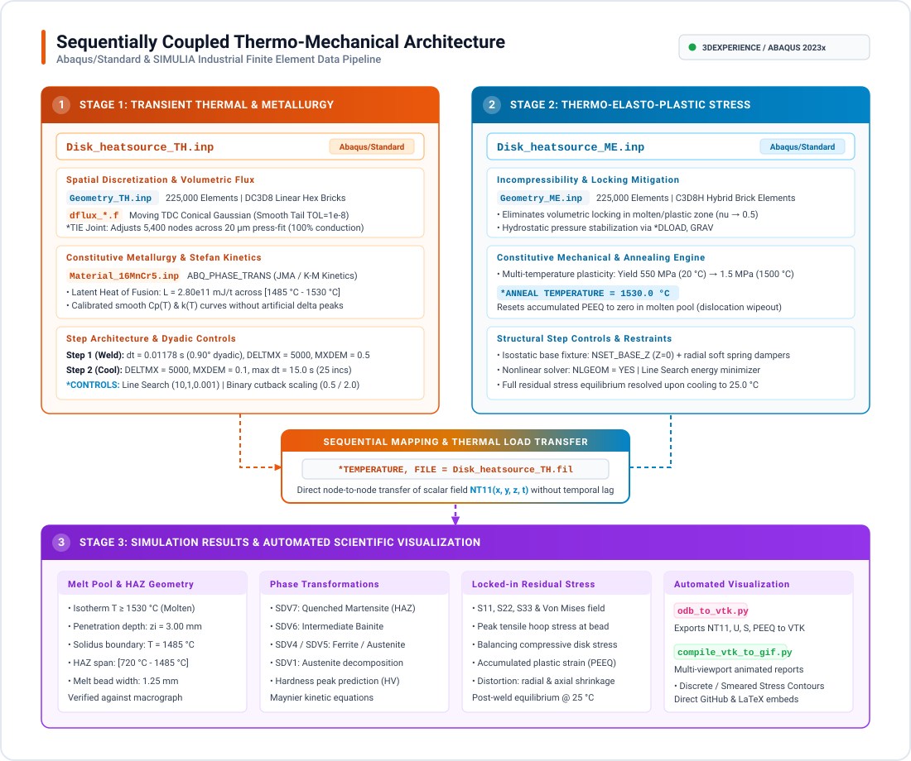

# Circumferential Laser Welding: Sequentially Coupled Thermo-Mechanical FEA & Phase Transformations

[](#)
[](https://www.3ds.com/)
[](#)
[](https://fortran-lang.org/)
[](../LICENSE)

<div align="justify">
An industrial-grade finite element analysis (FEA) framework simulating <b>circumferential laser welding</b> of an axisymmetric powertrain assembly (shaft-to-hub cylindrical press-fit joint) using Abaqus/Standard and SIMULIA 3DEXPERIENCE.
</div>

<div align="justify">
The project implements a <b>sequentially coupled thermo-mechanical analysis</b>:
<ol>
  <li><b>Thermal Stage (<code>Disk_heatsource_TH.inp</code>):</b> Solves transient 3D heat conduction using user subroutine <code>dflux_disk_conical_gaussian.f</code> (moving conical Gaussian volumetric heat source with angular power scheduling) coupled to metallurgical phase transformation kinetics (<code>Material_16MnCr5.inp</code>) in 16MnCr5 case-hardening gear steel.</li>
  <li><b>Mechanical Stage (<code>Disk_heatsource_ME.inp</code>):</b> Sequentially imports transient nodal temperatures (<code>*TEMPERATURE, FILE=Disk_heatsource_TH</code>), calculating thermal distortions, high-temperature plastic yielding, continuous annealing at $1500^\circ\text{C}$, and final locked-in residual stress states on a hybrid formulation mesh (<code>Geometry_ME.inp</code>, <code>C3D8H</code>).</li>
  <li><b>Automated Post-Processing Pipeline:</b> Includes batch scripts (<code>run_pipeline.sh</code>, <code>odb_to_vtk.py</code>, <code>compile_vtk_to_gif.py</code>) extracting <code>.odb</code> results into VTK unstructured grids and compiling multi-viewport animated GIF visual reports.</li>
</ol>
</div>

---

## 1. Physics & Mathematical Formulation

### 1.1 Conical Gaussian Heat Source (*q*(*r*, *z*))

<div align="justify">
The laser volumetric heat flux is formulated in a local cylindrical frame tracking the instantaneous position of the beam axis:
</div>

$$q(r, z) = Q_0 \cdot \exp\left( -3 \frac{r^2}{R_0(z)^2} \right)$$

<div align="justify">
where:
<ul>
  <li>$r = \sqrt{(X - X_c)^2 + (Y - Y_c)^2}$ is the radial distance from the beam focal center in the horizontal plane.</li>
  <li>$z$ is the depth measured from the top irradiated joint surface ($z = Z_0 - Z_{\text{coord}}$, with $0 \le z \le z_i$).</li>
  <li>$R_0(z)$ is the local conical beam radius at depth $z$, interpolating linearly between top surface radius $r_e$ and root radius $r_i$:</li>
</ul>
</div>

$$R_0(z) = r_e + (r_i - r_e) \frac{z}{z_i}$$

<p align="center">
  
</p>

### 1.2 Analytical Volume Energy Conservation (Farrokhi et al. / Wu et al. TDC Model)

<div align="justify">
To guarantee that the integrated thermal power inside the conical envelope ($r \le R_0(z)$, $0 \le z \le z_i$) strictly equals the absorbed laser power ($P_{\text{abs}} = \eta \cdot Q_{\text{tot}}$), the peak flux $Q_0$ is derived analytically by integrating the Three-Dimensional Conical (TDC) Gaussian distribution:
</div>

$$\int_V q(r, z) \, dV = \int_0^{z_i} \left[ \int_0^{R_0(z)} Q_0 \exp\left( -3 \frac{r^2}{R_0(z)^2} \right) 2\pi r \, dr \right] dz$$

<div align="justify">
Evaluating the radial Gaussian integral up to the cone boundary $r = R_0(z)$:
</div>

$$\int_0^{R_0(z)} \exp\left( -3 \frac{r^2}{R_0(z)^2} \right) 2\pi r \, dr = \frac{\pi R_0(z)^2}{3} \left( 1 - e^{-3} \right) = \frac{\pi R_0(z)^2}{3} \cdot \frac{e^3 - 1}{e^3}$$

<div align="justify">
Integrating along the conical penetration depth $z \in [0, z_i]$:
</div>

$$\int_0^{z_i} R_0(z)^2 \, dz = \int_0^{z_i} \left[ r_e + (r_i - r_e) \frac{z}{z_i} \right]^2 dz = \frac{z_i}{3} \left( r_e^2 + r_e r_i + r_i^2 \right)$$

<div align="justify">
Combining terms and equating to the absorbed beam power $\eta \cdot Q_{\text{tot}}$ yields the exact analytical prefactor (Farrokhi et al. 2019, Wu et al. 2006, Liu et al. 2022):
</div>

$$Q_0 = \frac{9 \, \eta Q_{\text{tot}} \, e^3}{\pi (e^3 - 1) z_i \left( r_e^2 + r_e r_i + r_i^2 \right)}$$

<div align="justify">
For nominal parameters ($P_l = 1800\text{ W}$, $\eta = 0.60 \implies P_{\text{abs}} = 1080\text{ W}$, $r_e = 1.0\text{ mm}$, $r_i = 0.75\text{ mm}$, and $z_i = 3.0\text{ mm}$), the analytical peak core flux is $Q_0 = 4.6935 \times 10^5\text{ mW/mm}^3$ ($469.35\text{ W/mm}^3$).
</div>

<p align="center">
  
</p>

### 1.3 Kinematics & Angular Power Schedule

<div align="justify">
The beam revolves along the circular joint interface ($R = 15.0\text{ mm}$) at linear travel speed $v = 20.0\text{ mm/s}$ ($1200\text{ mm/min}$):
</div>

$$\omega = \frac{v}{R} = 1.3333\text{ rad/s}, \qquad \theta(t) = \omega \cdot t$$
$$X_c(t) = R \cos(\theta), \qquad Y_c(t) = R \sin(\theta)$$

<div align="justify">
To prevent hot-cracking, initial thermal shock, and keyhole collapse defects at weld termination, the subroutine applies a continuous 3-stage angular power schedule:
</div>

| Segment | Angular Domain | Physical Time | Power Amplitude $\text{AMP}(\theta)$ | Purpose |
| :--- | :---: | :---: | :---: | :--- |
| **1. Ramp-Up** | $0^\circ \le \theta < 10^\circ$ | $0.000 \to 0.131\text{ s}$ | $\theta / 10^\circ$ (Linear) | Smooth keyhole initiation |
| **2. Steady Weld** | $10^\circ \le \theta \le 370^\circ$ | $0.131 \to 4.843\text{ s}$ | $1.000$ ($1080\text{ W}$ absorbed) | Full $360^\circ$ circumferential joint weld |
| **3. Ramp-Down Overlap** | $370^\circ < \theta \le 380^\circ$ | $4.843 \to 4.974\text{ s}$ | $1.0 - (\theta - 370^\circ)/10^\circ$ | Crater filling & hot-crack mitigation |
| **4. Beam Off** | $\theta > 380^\circ$ | $4.974 \to 6.000\text{ s}$ | $0.000$ | Solidification & initial cooling |

<div align="justify">
Total beam active time is $t_{\text{beam}} = 4.974\text{ s}$, transferring $E_{\text{net}} = 5,236\text{ J}$ ($261.8\text{ J/mm}$ heat input along the joint circumference).
</div>

---

## 2. Material Architecture & Phase Transformation Engine (`Material_16MnCr5.inp`)

### 2.1 Unified Material Card Strategy

<div align="justify">
In industrial finite element modeling, keeping a single material file (<code>Material_16MnCr5.inp</code>) shared by both thermal and mechanical simulations guarantees data consistency and prevents property mismatch:
<ul>
  <li><b>Thermal Step (<code>Disk_heatsource_TH.inp</code>):</b> Solves the energy conservation equation. Abaqus reads the thermo-physical properties (<code>*CONDUCTIVITY</code>, <code>*SPECIFIC HEAT</code>, <code>*LATENT HEAT</code>, <code>*DENSITY</code>) and evaluates the built-in phase transformation tables (<code>*PARAMETER TABLE</code>, <code>*PROPERTY TABLE</code>), ignoring elastic and plastic cards.</li>
  <li><b>Mechanical Step (<code>Disk_heatsource_ME.inp</code>):</b> Solves momentum balance. Abaqus reads the constitutive mechanical properties (<code>*ELASTIC</code>, <code>*EXPANSION</code>, <code>*PLASTIC</code>, <code>*ANNEAL TEMPERATURE</code>, <code>*DENSITY</code>), ignoring thermal conductivity and heat capacity.</li>
</ul>
</div>

Both input decks reference the identical material identifier:
```inp
*SOLID SECTION, ELSET=SHAFT_SECTION, MATERIAL="ABQ_PHASE_TRANS_16MNCR5"
*SOLID SECTION, ELSET=HUB_SECTION, MATERIAL="ABQ_PHASE_TRANS_16MNCR5"
```

### 2.2 Built-in Phase Transformation Kinetics (`ABQ_PHASE_TRANS`)

<div align="justify">
Rather than relying on external user subroutines (<code>HETVAL</code> or <code>USDFLD</code>), the thermal model leverages the built-in Abaqus metallurgical engine via constitutive parameter tables and solution-dependent state variables (<code>*DEPVAR</code>):
</div>

| State Variable (`*DEPVAR`) | Symbol | Metallurgical Phase / Metric | Admissible Range | Initial Value | Physical Interpretation in Abaqus / CAE Viewer |
| :---: | :---: | :--- | :---: | :---: | :--- |
| **`SDV1`** | $\text{RLS}$ | *Remaining Liquid Solidification* | $[0.0, 1.0]$ | $1.0$ (Solid) | $1.0 = \text{Solid State}$; $0.0 = \text{Molten Keyhole Pool}$ ($T \ge T_{\text{liquidus}}$) |
| **`SDV2`** | $f_{\text{col}}$ | Columnar Grain Fraction | $[0.0, 1.0]$ | $0.0$ | Solidification morphology ($G/R$ ratio under temperature gradient $G$ and velocity $R$) |
| **`SDV3`** | $d_\gamma$ | Prior Austenite Grain Size | $\ge 0\,\mu\text{m}$ | $0.0\,\mu\text{m}$ | Grain coarsening kinetics during high-temperature thermal cycling |
| **`SDV4`** | $f_F$ | Ferrite + Pearlite Fraction | $[0.0, 1.0]$ | $1.0$ | Base metal microstructural state prior to weld ($100\%$ Ferrite-Pearlite matrix) |
| **`SDV5`** | $f_A$ | High-Temperature Austenite | $[0.0, 1.0]$ | $0.0$ | High-temperature parent phase formed during rapid heating above $Ac_1 / Ac_3$ |
| **`SDV6`** | $f_B$ | Intermediate Bainite Fraction | $[0.0, 1.0]$ | $0.0$ | Continuous cooling product formed in the $[400^\circ\text{C}, 600^\circ\text{C}]$ window |
| **`SDV7`** | $f_M$ | Hard Martensite Fraction | $[0.0, 1.0]$ | $0.0$ | Diffusionless shear quench phase locked in the fusion zone and HAZ ($M_s = 400^\circ\text{C}$) |

#### Diffusional Phase Transformations (Austenite → Ferrite, Austenite → Bainite)
<div align="justify">
Governed by Johnson-Mehl-Avrami (JMA) isothermal transformation kinetics adapted to continuous cooling via the Scheil additivity rule:
</div>

$$f(t, T) = 1 - \exp\left( -k(T) \cdot t^{n(T)} \right)$$

<div align="justify">
where kinetic coefficients $k(T)$ and $n(T)$ are derived from the alloy's Time-Temperature-Transformation (TTT) diagrams:
<ul>
  <li><b>Austenite → Ferrite (<code>AtoF</code>):</b> Active in the continuous cooling interval $[550^\circ\text{C}, 810^\circ\text{C}]$.</li>
  <li><b>Austenite → Bainite (<code>AtoB</code>):</b> Active in the continuous cooling interval $[400^\circ\text{C}, 600^\circ\text{C}]$.</li>
</ul>
</div>

#### Displacive Martensitic Transformation (Austenite → Martensite)
<div align="justify">
Below the martensite start temperature ($M_s = 400^\circ\text{C}$), diffusionless shear transformation is calculated via the Koistinen-Marburger (K-M) equation:
</div>

$$f_M = f_A \cdot \left[ 1 - \exp\left( -\gamma \cdot (M_s - T) \right) \right]$$

<div align="justify">
with empirical rate coefficient $\gamma = 0.011\text{ K}^{-1}$ (<code>*PROPERTY TABLE, TYPE="ABQ_PHASE_TRANS_Martensitic_KM_Coefficients"</code>). The transformation is active below $400^\circ\text{C}$ down to room temperature.
</div>

#### Reverse Austenitization on Rapid Heating
<div align="justify">
During laser irradiation, rapid heating triggers reverse diffusional dissolution into austenite:
<ul>
  <li><b>Ferrite → Austenite (<code>FtoA</code>):</b> Active on heating from $720^\circ\text{C}$ up to solidus ($1485^\circ\text{C}$).</li>
  <li><b>Bainite → Austenite (<code>BtoA</code>):</b> Active on heating from $720^\circ\text{C}$ up to solidus ($1485^\circ\text{C}$).</li>
  <li><b>Martensite → Austenite (<code>MtoA</code>):</b> Active on heating from $650^\circ\text{C}$ up to solidus ($1485^\circ\text{C}$).</li>
</ul>
</div>

#### Latent Heat of Fusion
<div align="justify">
The phase change energy is accounted for across the calibrated mushy zone ($T_{\text{solidus}} = 1485^\circ\text{C}$ to $T_{\text{liquidus}} = 1530^\circ\text{C}$):
</div>

```inp
*PARAMETER TABLE, TYPE="ABQ_PHASE_TRANS_MeltingTemperature"
 1485, 1530,
*LATENT HEAT
 280e9, 1485, 1530, 1.0
```
<div align="justify">
where $L = 280\text{ kJ/kg}$ ($2.80 \times 10^{11}\text{ mJ/tonne}$).
</div>

### 2.3 Mechanical Constitutive Behavior & High-Temperature Annealing

<div align="justify">
<ul>
  <li><b>Thermal Expansion:</b> Temperature-dependent isotropic thermal expansion coefficient $\alpha(T)$ with reference temperature <code>ZERO=-273.15</code> up to $2800^\circ\text{C}$.</li>
  <li><b>Degradation of Elastic Modulus:</b> Young's modulus drops monotonically from $210\text{ GPa}$ ($20^\circ\text{C}$) to $500\text{ MPa}$ ($1530^\circ\text{C}$), with $2000\text{ MPa}$ residual fluid-like numerical stiffness up to $2800^\circ\text{C}$ to avoid element distortion singularities.</li>
  <li><b>Temperature-Dependent Plasticity:</b> Multi-curve strain hardening from $20^\circ\text{C}$ up to $1500^\circ\text{C}$ with linear extrapolation.</li>
  <li><b>Plastic Strain Reset (<code>*ANNEAL TEMPERATURE</code>):</b></li>
</ul>
</div>

```inp
*ANNEAL TEMPERATURE
 1530.0
```

<div align="justify">
Molten metal cannot store dislocation hardening. When an element exceeds $1530^\circ\text{C}$, Abaqus resets the equivalent plastic strain (<code>PEEQ = 0</code>), preventing artificial accumulated plastic distortion from corrupting the solid-state residual stress field during cool-down.
</div>

---

## 3. Sequentially Coupled Architecture & FEA Pipeline

<p align="center">
  
</p>

---

## 4. Industrial Numerical Engineering: Convergence Stabilization, Best Practices & Error Analysis

<div align="justify">
Simulating moving concentrated energy sources coupled to non-linear metallurgical phase transformations and high-temperature plasticity is notorious for severe numerical instability, convergence stalls, and artificial solution chattering. The present implementation applies a comprehensive suite of rigorous numerical best practices and convergence engineering principles:
</div>

### 4.1 Kinematic Dyadic Phase-Locking & Spatial-Temporal Mesh Synchronization

#### Theoretical Motivation:
<div align="justify">
In moving-source thermal FEA, capturing the steep temperature gradients across the laser fusion line requires synchronizing circumferential element size with time incrementation. When the laser heat source traverses element boundaries asynchronously, the solver samples random fractions of element volumes, inducing artificial temperature fluctuations, phase chattering, and severe Newton-Raphson cutbacks.
</div>

#### Kinematic Derivation & Mesh Topology:
- **Circumferential Mesh:** $N_\theta = 200$ structured hexahedral elements around the $360^\circ$ joint circumference.
- **Element Angular Span:** $\Delta\theta_{\text{elem}} = 360^\circ / 200 = 1.80^\circ$.
- **Half-Step Dyadic Increment:** Setting the time increment such that the laser advances exactly half an element ($\Delta\theta_{\text{step}} = 0.90^\circ = \pi/200\text{ rad}$) creates a strictly phase-locked kinematic sequence:
  - **Odd Increments ($k = 1, 3, 5, \dots$):** The heat source centroid aligns identically with the **element centroid** (midpoint).
  - **Even Increments ($k = 2, 4, 6, \dots$):** The heat source centroid aligns identically with the **inter-element nodal boundary**.

#### Exact Time Increment & Courant-Friedrichs-Lewy (CFL) Condition:
<div align="justify">
Given travel speed $v = 20.0\text{ mm/s}$ and joint radius $R = 15.0\text{ mm}$, the angular velocity is $\omega = v/R = 4/3\text{ rad/s}$. The theoretical analytical increment is:
</div>

$$\Delta t_{\text{exact}} = \frac{\Delta\theta_{\text{step}}}{\omega} = \frac{\pi / 200}{4/3} = \frac{3\pi}{800}\text{ s} \approx 0.01178097245096\dots\text{ s}$$

- **Courant Number:** Along the weld radius, element circumferential length is $\Delta h = 2\pi R / 200 = 0.4712\text{ mm}$. The thermal Courant number is:

$$C = \frac{v \cdot \Delta t}{\Delta h} = \frac{20.0 \cdot 0.011781}{0.4712} = 0.5000$$

<div align="justify">
A Courant number of exactly $C = 0.50$ guarantees that thermal flux is deposited at the optimal integration rate, eliminating spatial-temporal aliasing.
</div>

#### Numerical Discretization Error Analysis:
<div align="justify">
In the Abaqus input deck <code>Disk_heatsource_TH.inp</code>, the time step is specified to 10 decimal digits:
</div>

$$\Delta t_{\text{inp}} = 0.011780972500\text{ s}$$

<div align="justify">
The infinitesimal precision offset per increment is:
</div>

$$\delta t = \Delta t_{\text{inp}} - \Delta t_{\text{exact}} = +4.90 \times 10^{-11}\text{ s} \quad (\approx 3.75 \times 10^{-9\circ} \text{ per increment})$$

<div align="justify">
Propagating this deviation across the entire simulation:
<ul>
  <li><b>After 1 Full Revolution ($360^\circ$, Increment 400):</b> The cumulative angular error is $\Delta\theta_{\text{err}} = 1.50 \times 10^{-6\circ}$. The cumulative linear arc error at $R = 15.0\text{ mm}$ is:</li>
</ul>
</div>

$$\Delta s_{\text{err}} = R \cdot \Delta\theta_{\text{rad}} = 15.0 \cdot (1.50 \times 10^{-6} \cdot \pi / 180) \approx 3.92 \times 10^{-7}\text{ mm} = \mathbf{0.39\text{ nanometers}}$$

<div align="justify">
<ul>
  <li><b>At the End of Step 1 ($450^\circ$, Increment 500):</b> Cumulative arc error is $\mathbf{0.49\text{ nanometers}}$.</li>
</ul>
</div>

<div align="justify">
> <b>Error Impact:</b> Because the spatial drift ($0.39\text{ nm}$) is comparable to a single atomic lattice constant of $\alpha$-iron ($a_{\text{Fe}} \approx 0.286\text{ nm}$), spatial-temporal phase synchronization between the beam and the finite element mesh remains mathematically exact throughout the entire simulation.
</div>

---

### 4.2 Binary (Power-of-2) Adaptive Time Stepping Architecture

#### Problem Statement:
<div align="justify">
In moving-source simulations, standard Abaqus adaptive cutback defaults (e.g. cutback factor $D_f = 0.25$ and increase factor $D_C = 1.50$) destroy kinematic phase alignment. When an irrational time step is introduced, subsequent increments place the heat source at arbitrary, non-symmetric positions across element volumes. This triggers repeated cutbacks, step stalling, and severe run-time inflation.
</div>

#### Dyadic Solution (`*CONTROLS, PARAMETERS=TIME INCREMENTATION`):
<div align="justify">
To preserve element fractional symmetry under all numerical conditions, the solver is configured to scale increments strictly in powers of 2 ($2^n$):
</div>

```inp
*CONTROLS, PARAMETERS=TIME INCREMENTATION
8, 12, 9, 16, 10, 4, ,
0.5, 2.0, 0.5, 0.5, , 2.0, ,
```

<div align="justify">
<ul>
  <li><b>Binary Cutback Factor ($D_f = 0.5$, $D_B = 0.5$):</b> If a local non-linearity requires a step reduction, $\Delta t$ is halved strictly ($\Delta t / 2$). The beam advances by $0.45^\circ$, aligning precisely with a $1/4$ element fraction.</li>
  <li><b>Binary Recovery Factor ($D_C = 2.0$, $D_S = 2.0$):</b> Once equilibrium stabilizes, the solver doubles the time increment back to the nominal dyadic step ($0.90^\circ$).</li>
  <li><b>Equilibrium Iteration Guard ($I_0 = 8$, $I_R = 12$, $I_C = 16$):</b> Calibrated to accommodate the 3–4 iterations required under the unsymmetric Newton-Raphson scheme, preventing artificial step cutbacks during rapid transient passes.</li>
</ul>
</div>

---

### 4.3 Smooth Gaussian Tail Cutoff vs. Artificial Step Discontinuities

#### The Truncation Singularity:
<div align="justify">
In moving heat source subroutines, truncating the volumetric flux at the nominal cone radius $r = R_0(z)$ creates a severe numerical artifact:
</div>

$$q(R_0, z) = Q_0 \exp(-3) \approx 0.0498 \cdot Q_0$$

<div align="justify">
At the boundary $r = R_0(z)$, the volumetric flux drops abruptly from $5\%$ of peak power to $0\%$. As element Gauss integration points cross this boundary, the heat flux exhibits an infinite spatial gradient ($\partial q / \partial r \to \infty$). In Newton-Raphson equilibrium iterations, this artificial discontinuity induces high residual chattering and non-convergence.
</div>

#### Continuous Smooth Tail Implementation (`dflux_disk_conical_gaussian.f`):
<div align="justify">
The subroutine applies a smooth asymptotic decay envelope based on a numerical cutoff tolerance $\text{TOL} = 1.0 \times 10^{-8}$:
</div>

$$r_{\text{cut}}(z) = \sqrt{\frac{-\ln(\text{TOL})}{3}} \cdot R_0(z) = \sqrt{\frac{18.4207}{3}} \cdot R_0(z) \approx 2.4779 \cdot R_0(z)$$

```fortran
! Smooth Gaussian tail cutoff (TOL = 1.0d-8)
r_cut = sqrt(-log(cutoff_tol) / 3.0d0) * r0_z
if (r_dist_sq > (r_cut**2)) then
    q_vol = 0.0d0
    return
end if

! C-infinity smooth Gaussian volumetric flux
q_vol = amp_factor * q0_peak * exp(-3.0d0 * r_dist_sq / (r0_z**2))
```

<div align="justify">
<ul>
  <li>At $r = r_{\text{cut}}$, the flux value is identically $\exp(-3 \cdot 6.1402) = 1.0 \times 10^{-8} \approx 0$.</li>
  <li><b>Surface Clamping:</b> The depth coordinate is clamped to $z_{\text{local}} = \max(0.0, Z_{\text{surf}} - Z)$, ensuring that nodes on the irradiated boundary receive the full surface flux without clipping.</li>
</ul>
</div>

---

### 4.4 Phase Transformation Kinetics vs. Artificial Eurocode $C_p$ Spikes

#### Root Cause of High-Temperature Divergence:
<div align="justify">
Standard structural fire codes (e.g. EN 1993-1-2) model the latent heat of austenite decomposition by introducing a sharp artificial peak in specific heat ($C_p = 5.0 \times 10^9\text{ mJ/(tonne}\cdot\text{K)}$) across a narrow $10^\circ\text{C}$ band centered at $735^\circ\text{C}$.
</div>

<div align="justify">
When this Eurocode spike is accidentally imported into a model governed by built-in metallurgical phase transformation kinetics (<code>ABQ_PHASE_TRANS</code>), it creates a catastrophic numerical collision:
<ol>
  <li>The metallurgical engine is already calculating enthalpy changes and latent heat through transformation kinetics (JMA / Koistinen-Marburger models).</li>
  <li>The 10-fold delta peak in $C_p$ introduces a massive discontinuity in the internal energy tangent matrix:</li>
</ol>
</div>

$$\frac{\partial U}{\partial T} = C_p(T)$$

<div align="justify">
As the molten weld pool boundary heats through $730^\circ\text{C} - 750^\circ\text{C}$, Newton-Raphson tangent corrections oscillate wildly, triggering severe consecutive divergences and solver failure.
</div>

#### Calibrated Smooth Material Solution (`Material_16MnCr5.inp`):
<div align="justify">
In the validated 16MnCr5 material deck:
<ul>
  <li>Specific heat curves for all 4 solid phases (Ferrite, Austenite, Bainite, Martensite) remain smooth and physical ($4.58 \times 10^8 \le C_p \le 6.88 \times 10^8\text{ mJ/(tonne}\cdot\text{K)}$) up to $1530^\circ\text{C}$.</li>
  <li>Latent heat of fusion ($L = 2.80 \times 10^{11}\text{ mJ/tonne}$) is governed strictly by <code>*LATENT HEAT</code> between solidus ($1485^\circ\text{C}$) and liquidus ($1530^\circ\text{C}$), completely decoupling solid-state kinetics from liquid phase change.</li>
</ul>
</div>

---

### 4.5 Convergence Architecture: Unsymmetric Jacobian (`UNSYMM=YES`), Reference Flux & Damping Removal

<div align="justify">
Nonlinear transient phase change and metallurgical transformation problems require specific solver configurations to achieve quadratic convergence and eliminate increment crawling:
<ol>
  <li><b>Unsymmetric Solver Formulation (<code>*STEP, ..., UNSYMM=YES</code>):</b></li>
</ol>
</div>

```inp
*STEP, NAME=WELDING_STEP_THERMAL, AMPLITUDE=STEP, INC=10000, UNSYMM=YES
*HEAT TRANSFER, DELTMX=5000.
```

<div align="justify">
The solid-state phase transformation kinetics in <code>ABQ_PHASE_TRANS_16MNCR5</code> (Leblond, Koistinen-Marburger, and JMAK rate equations) coupled with latent heat enthalpy rates introduce strong off-diagonal non-symmetry into the tangent conductivity/effective capacity matrix:
</div>

$$\mathbf{K}_{ij} = \frac{\partial R_i}{\partial T_j} \ne \frac{\partial R_j}{\partial T_i}$$

<div align="justify">
When <code>UNSYMM=YES</code> is omitted, Abaqus defaults to the symmetric direct sparse solver ($\mathbf{K}_{\text{sym}} = \frac{1}{2}(\mathbf{K} + \mathbf{K}^T)$). This strips Newton-Raphson of its quadratic convergence rate, causing the residual to decay with a sluggish geometric contraction factor ($\rho \approx 0.69$ per iteration), leading to 18–30 iterations per increment and catastrophic cutbacks. Enabling <code>UNSYMM=YES</code> factors the full unsymmetric Jacobian, restoring quadratic Newton convergence ($R_{k+1} \propto R_k^2$) in just <b>3–4 iterations</b>.
</div>

<div align="justify">
<ol start="2">
  <li><b>Localized Reference Heat Flux (<code>*CONTROLS, PARAMETERS=FIELD, FIELD=TEMPERATURE</code>):</b></li>
</ol>
</div>

```inp
*CONTROLS, PARAMETERS=FIELD, FIELD=TEMPERATURE
0.01, 0.02, , 250.0, 0.05
```

<div align="justify">
In standard Abaqus heat transfer, the residual equilibrium tolerance is computed as $R_{\text{tol}} = R_n^\alpha \cdot \tilde{q}$, where $\tilde{q}$ is the time-averaged flux across the <i>entire mesh</i>. In this 225,000-element model, over 99.7% of elements are outside the laser spot ($q = 0$). Dilution drops $\tilde{q}$ to $\sim 25\text{ mW/mm}^3$, forcing an unphysically microscopic residual tolerance of $0.125\text{ mW/mm}^3$ against a peak laser source of $469,000\text{ mW/mm}^3$ ($2.6 \times 10^{-7}$ relative error). Setting an explicit characteristic weld pool flux norm $\bar{q} = 250.0\text{ mW/mm}^3$ locks the tolerance to $2.5\text{ mW/mm}^3$ ($5 \times 10^{-6}$ relative tolerance), preventing spurious solver rejections.
</div>

<div align="justify">
<ol start="3">
  <li><b>Deactivation of Line Search:</b></li>
</ol>
Line Search scale factors ($\eta \in [0.35, 0.72]$) artificially under-relax Newton steps across the latent heat plateau ($1485^\circ\text{C} - 1530^\circ\text{C}$), trapping temperatures inside the transition zone and causing iteration stalling. Removing line search enables uninhibited Newton-Raphson steps across phase fronts.
</div>

---

### 4.6 Output Decoupling & Sequential Mechanical Transfer (`FREQUENCY` vs `NUMBER INTERVAL`)

#### The Pitfall of `NUMBER INTERVAL` with `TIME MARKS=YES`:
<div align="justify">
When <code>NUMBER INTERVAL = N, TIME MARKS = YES</code> is used in transient thermal analysis:
<ul>
  <li>The solver is forced to chop its time increment $\Delta t$ whenever an arbitrary time mark is reached.</li>
  <li>This immediately destroys the dyadic kinematic alignment ($\Delta t = 0.01178\dots\text{ s}$), throwing the laser off-center and forcing premature cutbacks.</li>
</ul>
</div>

#### The Clean Increment Architecture (`FREQUENCY = 1`):
<div align="justify">
In both Step 1 and Step 2:
</div>

```inp
*OUTPUT, FIELD, FREQUENCY=1
*NODE OUTPUT
NT,
*ELEMENT OUTPUT
SDV1, SDV4, SDV5, SDV6, SDV7
*NODE FILE, FREQUENCY=1
NT,
```

<div align="justify">
<ul>
  <li><b>Zero Solver Interference:</b> <code>FREQUENCY = 1</code> writes frames strictly when an increment naturally converges, without ever modifying $\Delta t$.</li>
  <li><b>Unified Transfer File:</b> The Abaqus sequential temperature transfer command (<code>*TEMPERATURE, FILE=Disk_heatsource_TH.fil</code>) reads results directly from <code>*NODE FILE</code>, which only supports <code>FREQUENCY</code>. Synchronizing both ODB and FIL outputs at <code>FREQUENCY = 1</code> guarantees that the structural mesh interpolates the thermal history with zero temporal lag.</li>
</ul>
</div>

---

### 4.7 Micrometric Press-Fit Interference & Thermal Joint Continuity

<div align="justify">
In industrial manufacturing, the shaft-hub joint is assembled via a radial interference fit prior to laser welding:
<ul>
  <li><b>Shaft Outer Radius:</b> $R_{\text{shaft}} = 15.020\text{ mm}$</li>
  <li><b>Hub Inner Radius:</b> $R_{\text{hub}} = 15.000\text{ mm}$</li>
  <li><b>Radial Interference:</b> $\delta_r = 0.020\text{ mm}$ ($20\,\mu\text{m}$)</li>
</ul>
</div>

<div align="justify">
To model immediate, perfect thermal conduction across the pressed interface without artificial contact resistance or numerical chattering:
</div>

```inp
*TIE, NAME=TIE_JOINT, TYPE=SURFACE TO SURFACE, ADJUST=YES, POSITION TOLERANCE=0.05
SURF_HUB_RADIAL, SURF_SHAFT_RADIAL
```

<div align="justify">
During model initialization, Abaqus adjusts 5,400 interface nodes by exactly $0.019999\text{ mm}$, closing the interference gap geometrically and enforcing $100\%$ heat conduction through the joint ahead of the advancing laser keyhole.
</div>

---

### 4.8 Mitigation of Volumetric Locking (`C3D8H` Hybrid Elements)

<div align="justify">
At temperatures near melting ($T > 1200^\circ\text{C}$) and in the plastic regime, steel behaves near-incompressibly ($\nu \to 0.5$). In standard first-order brick elements (<code>C3D8</code>), the kinematic incompressibility constraint causes severe <b>volumetric locking</b> across the steep thermal gradient of the fusion line, leading to negative Jacobians ($\det(J) \le 0$) and premature Newton-Raphson divergence.
</div>

#### Engineering Solution:
<div align="justify">
<ul>
  <li><code>Geometry_ME.inp</code> converts all solid elements to <b><code>C3D8H</code> (8-node linear brick, hybrid with constant pressure)</b>. Hydrostatic pressure is treated as an independently interpolated variable, eliminating volumetric locking.</li>
  <li>Body-force gravity loading (<code>*DLOAD, GRAV</code>) stabilizes the hydrostatic pressure field in molten regions.</li>
</ul>
</div>

---

## 5. Project File Structure

```text
02_dflux_laser_welding/
├── Disk_heatsource_TH.inp                 # Thermal master input deck (DC3D8, 2-step welding & cooling)
├── Disk_heatsource_ME.inp                 # Mechanical master input deck (C3D8H, sequentially coupled)
├── Geometry_TH.inp                        # Thermal mesh deck (DC3D8 heat transfer solid bricks)
├── Geometry_ME.inp                        # Mechanical mesh deck (C3D8H hybrid elements, NSET_BASE)
├── Material_16MnCr5.inp                   # Unified thermo-elasto-plastic & phase transformation deck
├── dflux_disk_conical_gaussian.f          # User subroutine (Modern Fortran 2008/90, TDC model)
├── compile_vtk_to_gif.py                  # Multi-viewport 3DEXPERIENCE simulation report compiler
├── odb_to_vtk.py                          # Abaqus Python ODB to VTK ASCII exporter & ZIP packager
├── run_pipeline.sh                        # HPC / batch automated execution pipeline
└── README.md                              # Technical report & documentation
```

---

## 6. Execution Guide (Abaqus / 3DEXPERIENCE)

### Automated Pipeline Execution

Execute the entire decoupled workflow or individual stages via `run_pipeline.sh`:

```bash
# Run full decoupled pipeline (Thermal FEA -> Thermal VTK -> Mechanical FEA -> Mechanical VTK)
./run_pipeline.sh all

# Or run stage-by-stage:
./run_pipeline.sh therm      # Runs Disk_heatsource_TH.inp + dflux_disk_conical_gaussian.f
./run_pipeline.sh vtk_therm  # Exports laser_therm_vtk.zip
./run_pipeline.sh mech       # Runs Disk_heatsource_ME.inp
./run_pipeline.sh vtk_mech   # Exports laser_mech_vtk.zip
```

### Manual Command-Line Execution

#### 1. Thermal Analysis
```bash
abaqus job=Disk_heatsource_TH input=Disk_heatsource_TH.inp user=dflux_disk_conical_gaussian.f cpus=4 interactive
```

#### 2. Thermal Result Extraction (VTK ZIP)
```bash
abaqus python odb_to_vtk.py Disk_heatsource_TH.odb --prefix=laser_therm
```

#### 3. Mechanical Analysis (Importing Thermal History)
```bash
abaqus job=Disk_heatsource_ME input=Disk_heatsource_ME.inp cpus=4 interactive
```

#### 4. Mechanical Result Extraction (VTK ZIP)
```bash
abaqus python odb_to_vtk.py Disk_heatsource_ME.odb --prefix=laser_mech
```

#### 5. Generate Multi-Viewport Animated Visual Report
```bash
python compile_vtk_to_gif.py laser_mech_vtk.zip --fps 15 -o laser_welding_report.gif
```

---

## 7. Key Results to Evaluate

<div align="justify">
<ul>
  <li><b>Melt Pool Geometry:</b> Isotherm $T \ge T_{\text{liquidus}} = 1530^\circ\text{C}$ identifies the molten weld bead width and penetration depth ($z_i \approx 3.0\text{ mm}$).</li>
  <li><b>Heat Affected Zone (HAZ):</b> Region bounded between $Ac_1 \approx 720^\circ\text{C}$ and $T_{\text{solidus}} = 1485^\circ\text{C}$.</li>
  <li><b>Phase Distributions (<code>SDV4</code>–<code>SDV7</code>):</b> Martensite formation in the rapidly cooled HAZ and bainite/ferrite in adjacent parent material.</li>
  <li><b>Residual Stress State:</b> Peak hoop ($\sigma_{\theta\theta}$) and axial ($\sigma_{zz}$) tensile stresses locked along the weld fusion line, balanced by compressive stress in the surrounding shaft and hub body.</li>
</ul>
</div>

---

## 8. Standards & References

1. **Farrokhi, F., Endelt, B., & Kristiansen, M. (2019):** *A numerical model for full and partial penetration hybrid laser welding of thick-section steels*, Optics & Laser Technology, 109, 629–642.
2. **Wu, C. S., Wang, H. G., & Zhang, Y. M. (2006):** *A new heat source model for keyhole plasma arc welding in FEM analysis of the temperature profile*, Welding Journal, 85(12), 284–291.
3. **Liu, M., Kouadri-Henni, A., & Malard, B. (2022):** *Simulation of low-cycle fatigue residual stress in DP600 steel laser-welded structure*, 11th International Conference on Residual Stresses (ICRS11), Nancy, France.
4. **EN 1993-1-2:2005:** *Eurocode 3: Design of steel structures — Part 1-2: General rules — Structural fire design* (temperature-dependent thermal properties).
5. **EN 10084:** *Case hardening steels — Technical delivery conditions* (chemical composition of 16MnCr5).
6. **Andrews, K. W. (1965):** *Empirical formulae for the calculation of critical temperatures in steels*, Journal of the Iron and Steel Institute (JISI), 203, 721–727.
7. **Koistinen, D. P., & Marburger, R. E. (1959):** *A general equation prescribing the extent of the austenite-martensite transformation in pure iron-carbon alloys and plain carbon steels*, Acta Metallurgica, 7(1), 59–60.

---

## 9. Author & Contact

**Victor Maia**  
- **Email:** [vhfm08@gmail.com](mailto:vhfm08@gmail.com)  
- **GitHub:** [@vhfmaia](https://github.com/vhfmaia)  
- **Specialization:** Advanced Abaqus Subroutines (`UMAT`, `VUMAT`, `DLOAD`, `DFLUX`, `DISP`, `USDFLD`, `HETVAL`) & FEA Simulation Automation
