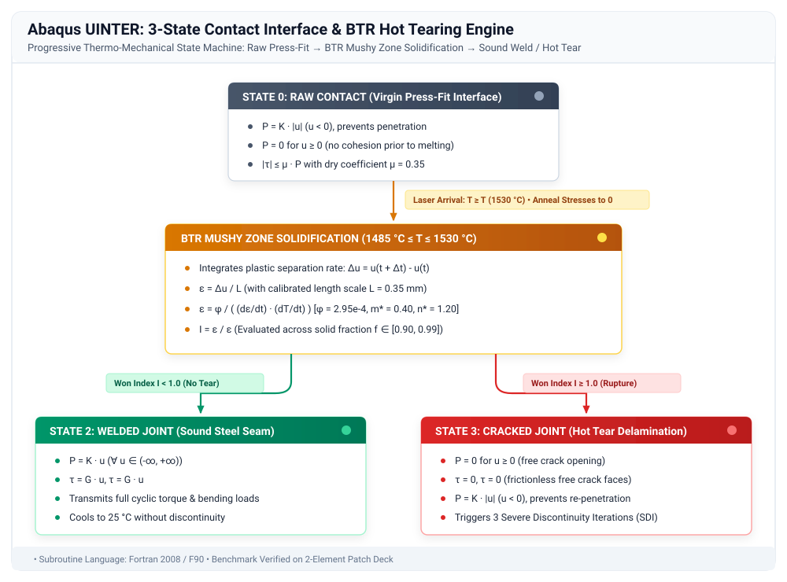

# 03. 3-State Contact Interface & BTR Hot Cracking (`UINTER`)

[-orange.svg)](#)
[](https://www.3ds.com/)
[](#)
[](https://fortran-lang.org/)
[](../LICENSE)

---

## Executive Summary & Engineering Status

> [!WARNING]
> **DEVELOPMENT STATUS: EXPLORATORY RESEARCH / IN WORK (R&D BACKLOG)**  
> This directory documents an exploratory implementation of an Abaqus/Standard **User Interaction Subroutine (`UINTER`)** designed to model the progressive multi-stage constitutive behavior of a welded joint (**Raw $\rightarrow$ Welded $\rightarrow$ Cracked**) governed by an **empirical Won / Prokhorov hot tearing criterion**.  
>
> While conceptually elegant, **rigorous finite-element benchmarking revealed fundamental numerical bottlenecks**—primarily **pathological mesh dependency** and **severe discontinuity iterations (SDI cutbacks)**. Consequently, this interface formulation is preserved here for research reference and is **evaluated alongside the regularized Cohesive Zone UMAT architecture** documented in [**`04_umat_cohesive_welding`**](../04_umat_cohesive_welding/README.md).

---

## 1. Physical Motivation: The 3-State Contact Interface

<div align="justify">
In conventional finite element welding analyses, joint interfaces are typically simplified via static <code>*TIE</code> constraints (as in baseline sequential thermal-mechanical pipelines). However, a <code>*TIE</code> constraint glues the entire 360° circumference from time $t = 0$, completely ignoring:
</div>

1. **Pre-weld joint gaps and press-fit mechanics** ahead of the advancing beam;
2. **Semi-solid mushy zone tearing** during cooling through the **Brittleness Temperature Range (BTR)**;
3. **Permanent weld seam rupture or hot cracking**.

<div align="justify">
To bridge this gap, an interaction model was formulated to dynamically transition between three discrete constitutive states:
</div>

<p align="center">
  
</p>

---

## 2. Anatomy of the `UINTER` Subroutine & Parameter Breakdown

<div align="justify">
The subroutine is invoked by Abaqus/Standard at every contact slave node / integration point where a user interaction is assigned (<code>*SURFACE INTERACTION, USER</code>).
</div>

### 2.1 Interface Definition & Keyword Deck

```abaqus
*SURFACE INTERACTION, NAME=WELD_CONTACT, USER, PROPERTIES=6, DEPVAR=16
0.35,
0.35, 1485.0, 1530.0, 2.95E-4, 0.40, 1.20
*CONTACT PAIR, INTERACTION=WELD_CONTACT, TYPE=SURFACE TO SURFACE
SURF_SLAVE, SURF_MASTER
```

### 2.2 Detailed Parameter Analysis & Empirical Origin

<div align="justify">
All material and process constants in <code>PROPS</code> were obtained through <b>empirical high-temperature characterization</b>:
</div>

| Parameter | Identifier in Code | Value | Physical Significance | Experimental / Empirical Origin |
| :--- | :--- | :---: | :--- | :--- |
| **Data Line 1** | `PAD_THICKNESS` ($L_0$) | $0.35\text{ mm}$ | Virtual element length scale | Calibrated to the radial depth of adjacent critical elements |
| **`PROPS(1)`** | `MU_VIRGIN` | $0.35$ | Virgin Coulomb friction coefficient | Calibrated from dry metal-to-metal press-fit push-out tests |
| **`PROPS(2)`** | `T_SOLIDUS` | $1485.0\,^\circ\text{C}$ | Solidus temperature (16MnCr5) | Differential Scanning Calorimetry (DSC) & Scheil solidification |
| **`PROPS(3)`** | `T_LIQUIDUS` | $1530.0\,^\circ\text{C}$ | Liquidus temperature (16MnCr5) | DSC high-temperature thermal analysis ($45^\circ\text{C}$ BTR span) |
| **`PROPS(4)`** | `PHI_CONST` ($\phi$) | $2.95 \times 10^{-4}$ | Empirical Won ductility coefficient | High-temperature Gleeble hot tensile tearing tests |
| **`PROPS(5)`** | `M_STAR` ($m^{\ast}$) | $0.40$ | Strain-rate sensitivity exponent | Fit from strain-rate jump tests in the mushy zone ($10^{-4} - 10^{-1}\,\text{s}^{-1}$) |
| **`PROPS(6)`** | `N_STAR` ($n^{\ast}$) | $1.20$ | Cooling rate sensitivity exponent | Solidification morphology / secondary dendrite arm spacing (SDAS) fit |

<div align="justify">
<b>Why are these parameters empirical?</b> Direct physical measurement of tensile ductility during solidification is virtually impossible using classical static testing machines because the material is a fragile dendritic slurry ($f_s \in [0.90, 0.99]$) surrounded by liquid segregation films. Parameters $\phi$, $m^{\ast}$, and $n^{\ast}$ must be calibrated on specialized <b>Gleeble thermo-mechanical physical simulators</b> or <b>Transvarestraint testing rigs</b> by pulling the specimen at controlled stroke rates during rapid cooling.
</div>

---

### 2.3 Internal State Variables (`STATEV 1..16`)

<div align="justify">
Abaqus allocates 16 solution-dependent state variables (<code>DEPVAR=16</code>) to track the local metallurgical and mechanical history at each contact node:
</div>

| Variable | Description | Physical Unit |
| :--- | :--- | :---: |
| `STATEV(1)` | **Weld State Flag** (`0`: Raw, `1`: BTR Solidifying, `2`: Welded, `3`: Cracked) | Integer |
| `STATEV(2)` | **Peak Historic Temperature** reached by node ($T_{\max}$) | $^\circ\text{C}$ |
| `STATEV(3)` | **Accumulated Tensile Opening** across interface during BTR ($\Delta u_{n,\text{accum}}$) | $\text{mm}$ |
| `STATEV(4)` | **Current Apparent Strain Rate** ($\dot{\varepsilon} = \frac{\Delta u_n / L_0}{\Delta t}$) | $\text{s}^{-1}$ |
| `STATEV(5)` | **Current Cooling Rate** ($\dot{T} = |\Delta T / \Delta t|$) | $^\circ\text{C/s}$ |
| `STATEV(6)` | **Instantaneous Won Critical Strain** ($\varepsilon_{\text{crit}}$) | Dimensionless |
| `STATEV(7)` | **Instantaneous Won Damage Index** ($I_{\text{Won}} = \varepsilon_{\text{eval}} / \varepsilon_{\text{crit}}$) | Dimensionless |
| `STATEV(8)` | **Peak Historical Won Ratio** ($R_{\max} = \max(I_{\text{Won}})$) | Dimensionless |
| `STATEV(9)` | **Fracture Temperature** ($T_{\text{frac}}$ at moment of tear) | $^\circ\text{C}$ |
| `STATEV(10)` | **Solid Fraction** in BTR ($f_s \approx \frac{T_{\text{liq}} - T}{T_{\text{liq}} - T_{\text{sol}}}$) | $[0.0, 1.0]$ |
| `STATEV(11)` | **Current Normal Bond Stiffness** ($K_{\text{bond}}$) | $\text{N/mm}^3$ |
| `STATEV(12)` | **Effective Virtual Pad Length** ($L_0$) | $\text{mm}$ |
| `STATEV(13..16)` | Tangential slip accumulation, thermal timestamp, and contact status | — |

---

## 3. The Won Hot Tearing Formulation

### 3.1 Mathematical Theory

<div align="justify">
The classical hot tearing criterion of <b>Won, Yeo, Seol, and Yim (2000)</b> posits that solidification cracking occurs when the accumulated tensile strain within the critical solid fraction range ($f_s = 0.90 - 0.99$, corresponding to the BTR) exceeds a threshold $\varepsilon_{\text{crit}}$ that depends on both the strain rate $\dot{\varepsilon}$ and the thermal cooling rate $\dot{T}$:
</div>

$$\varepsilon_{\text{crit}} = \frac{\phi}{\dot{\varepsilon}^{m^{\ast}} \cdot \dot{T}^{n^{\ast}}}$$

<div align="justify">
<ul>
  <li>At <b>higher strain rates</b> ($\dot{\varepsilon} \uparrow$), liquid feeding cannot replenish opening voids, reducing the critical strain ($\varepsilon_{\text{crit}} \downarrow$).</li>
  <li>At <b>higher cooling rates</b> ($\dot{T} \uparrow$), finer dendritic spacing shortens the time available for stress relaxation, lowering crack resistance.</li>
</ul>
</div>

### 3.2 Evaluation in `UINTER`

<div align="justify">
Inside the BTR interval ($T_{\text{solidus}} \le T \le T_{\text{liquidus}}$), the subroutine computes:
</div>

$$\varepsilon_{\text{eval}} = \frac{\Delta u_{n,\text{accum}}}{L_0}, \quad I_{\text{Won}} = \frac{\varepsilon_{\text{eval}}}{\varepsilon_{\text{crit}}}$$

$$\text{If } I_{\text{Won}} \ge 1.0 \implies \text{State} \rightarrow \mathbf{CRACKED} \quad (P_n = 0 \text{ in tension})$$

---

## 4. Empirical Temporal Discretization Benchmark (2, 3, 4, 5 Points in BTR)

<div align="justify">
To evaluate the numerical sensitivity and temporal dependency of <code>UINTER</code>, four systematic simulations were executed using the identical 2-element patch model (<code>dummy_btr_coarse_*points_normalized.inp</code>). The cooling rate was kept strictly constant at $\dot{T} = 2812.5\,^\circ\text{C/s}$ across the $45^\circ\text{C}$ BTR span ($\Delta t_{\text{BTR}} = 0.0160\text{ s}$), while Step 5 was discretized to place exactly 2, 3, 4, and 5 temporal sampling points within the BTR:
</div>

| Numerical Metric | 2 Points in BTR | 3 Points in BTR | 4 Points in BTR | 5 Points in BTR | Asymptotic Behavior |
| :--- | :---: | :---: | :---: | :---: | :---: |
| **Fixed $\Delta t$ in Step 5** | $0.01185\text{ s}$ | $0.00790\text{ s}$ | $0.00547\text{ s}$ | $0.00444\text{ s}$ | $2.7\times$ temporal refinement |
| **Fracture Step 5 Inc.** | **Inc. 5** | **Inc. 6** | **Inc. 8** | **Inc. 10** | Proportional tracking |
| **Fracture Temp. ($T_{\text{frac}}$)** | **$1469.67\,^\circ\text{C}$** | **$1469.67\,^\circ\text{C}$** | **$1479.92\,^\circ\text{C}$** | **$1478.00\,^\circ\text{C}$** | Resolves solidus boundary |
| **Incremental Strain ($\Delta \varepsilon_{\text{inc}}$)** | $8.53 \times 10^{-3}$ | $9.36 \times 10^{-3}$ | $4.04 \times 10^{-3}$ | $2.58 \times 10^{-3}$ | Proportional to $\Delta t$ |
| **Won Index ($\varepsilon / \varepsilon_{\text{crit}}$)** | $1.2866$ | $1.2515$ | $1.1062$ | $1.1394$ | Converges to $\approx 1.12$ |
| **Severe Discontinuities** | 3 SDI iters | 3 SDI iters | 3 SDI iters | 3 SDI iters | Systematic across nodes 9–12 |
| **Final Gap `COPEN` ($25^\circ\text{C}$)** | **$2.0636\,\mu\text{m}$** | **$2.0663\,\mu\text{m}$** | **$2.0680\,\mu\text{m}$** | **$2.0684\,\mu\text{m}$** | **Monotonic ($< 0.23\%$ error)** |
| **Final Pressure `CPRESS`** | $-970.2\text{ MPa}$ | $-971.5\text{ MPa}$ | $-972.3\text{ MPa}$ | $-972.5\text{ MPa}$ | **Monotonic ($< 0.24\%$ error)** |

### Key Engineering Findings:
<div align="justify">
<ol>
  <li><b>Asymptotic Structural Convergence:</b> Once ruptured, the final room-temperature crack opening <code>COPEN</code> converges monotonically with an error below $0.23\%$ ($2.0636\,\mu\text{m} \rightarrow 2.0684\,\mu\text{m}$), demonstrating that the post-rupture contact release mechanics are structurally sound.</li>
  <li><b>Thermal Sampling Overshoot:</b> Coarse time stepping ($\le 3$ points in BTR) skips past the solidus temperature ($1485^\circ\text{C}$), registering fracture with a numerical lag at $1469.67^\circ\text{C}$. A minimum of <b>4 to 5 increments inside the BTR</b> ($\Delta t \le 0.005\text{ s}$) is strictly necessary to resolve the true physical onset of hot tearing.</li>
  <li><b>Severe Discontinuity Overhead:</b> In all cases, the sudden loss of cohesion across interface nodes triggers <b>3 Severe Discontinuity Iterations (SDI)</b> before standard Newton-Raphson equilibrium can be re-established.</li>
</ol>
</div>

---

## 5. Critical Bottlenecks of the Contact Formulation

<div align="justify">
Despite its conceptual elegance, three fundamental limitations prevent practical deployment:
<ol>
  <li><b>Pathological Mesh Dependency:</b> Operating on discrete displacement jumps $\Delta u_n$ forces the use of a virtual length scale $L_0$. If the mesh is refined from $0.35\text{ mm}$ to $0.10\text{ mm}$, apparent strain concentrates into fewer nodes, triggering false-positive tears everywhere.</li>
  <li><b>Contact Chattering &amp; SDI Cutbacks:</b> Instantaneous stiffness switching ($0 \to K_{\text{bond}}$) triggers severe solver cutbacks (<code>1U</code>, <code>2U</code>, <code>3U</code>), increasing CPU cost by $5\times - 8\times$.</li>
  <li><b>MPI Domain Conflicts:</b> Master/slave surfaces partitioned across multiple CPU cores introduce communication locks.</li>
</ol>
</div>

---

## 6. Architectural Comparison: UINTER vs. Cohesive UMAT

<div align="justify">
To evaluate solutions for these limitations, research expanded to investigate a <b>Cohesive Zone Modeling (CZM)</b> approach via a thermo-mechanical <code>UMAT</code>:
</div>

| Performance Metric | Surface Interaction (`UINTER`) | Cohesive Zone (`UMAT` + `COH3D8`) |
| :--- | :--- | :--- |
| **Mathematical Domain** | 2D Contact Master/Slave Surface | Continuous Interface Finite Elements |
| **Mesh Dependency** | ❌ **High** (arbitrary $L_0$ scaling) | ✅ **Zero** (regularized by fracture energy $G_c$) |
| **Solver Convergence** | ⚠️ High SDI cutbacks & chattering | ✅ Smooth quadratic Newton-Raphson |
| **HPC / MPI Scaling** | ⚠️ Domain boundary communication bottlenecks | ✅ Perfect linear scaling (element-local integration) |
| **Development Status** | ⚠️ Exploratory Research (Backlog) | ⚠️ **In Work / Testing Phase** ([Project 04](../04_umat_cohesive_welding/README.md)) |

---

## 7. Scientific Bibliography & References

1. **Won, Y. M., Yeo, T. J., Seol, D. J., & Yim, K. H. (2000).**  
   *"A new criterion for internal crack formation in continuously cast steels."*  
   *Metallurgical and Materials Transactions A*, 31(3), 779–794.  
   *(Foundational paper establishing the empirical Won power-law criterion for hot tearing as a function of cooling rate and strain rate).*

2. **Rappaz, M., Drezet, J. M., & Gremaud, M. (1999).**  
   *"A new failure criterion for macrosegregation and hot tearing."*  
   *Metallurgical and Materials Transactions A*, 30(2), 449–455.  
   *(The definitive Rappaz-Drezet-Gremaud RDG model based on interdendritic liquid pressure drop and permeability).*

3. **Prokhorov, N. N. (1962).**  
   *"The technological strength of metals during crystallization in welding."*  
   *Svarochnoe Proizvodstvo (Welding Production)*, 4, 1–8.  
   *(Pioneering literature introducing the concept of the Brittleness Temperature Range / BTR and critical deformation reserve).*

4. **Pellini, W. S. (1952).**  
   *"Strain theory of hot tearing."*  
   *Foundry*, 80(11), 125–133.  
   *(Earliest experimental demonstration that hot tears initiate when tensile strains open liquid films prior to solidus completion).*

5. **Drezet, J. M., & Rappaz, M. (1996).**  
   *"Direct chill casting of aluminium alloys: in situ determination of deformation and hot tearing."*  
   *Light Metals*, 939–946.

6. **Dassault Systèmes SIMULIA (2023).**  
   *Abaqus User Subroutines Reference Guide: Section UINTER — "User subroutine to define surface interaction behavior."*  
   *Abaqus Theory Guide: Section 5.1 — "Contact Formulation and Severe Discontinuity Iterations."*

---

## 8. File Inventory

```text
03_uinter_welding_interface/
├── uinter_btr_hot_cracking.f        # User Subroutine (UINTER state machine in Fortran)
├── dummy_btr_contact_patch.inp      # 2-Element unit verification patch test deck
└── README.md                        # Technical report & research documentation
```

<div align="justify">
> <b>Next Step:</b> See <a href="../04_umat_cohesive_welding/README.md"><b>04_umat_cohesive_welding</b></a> for the mesh-independent cohesive UMAT prototype currently under evaluation.
</div>
