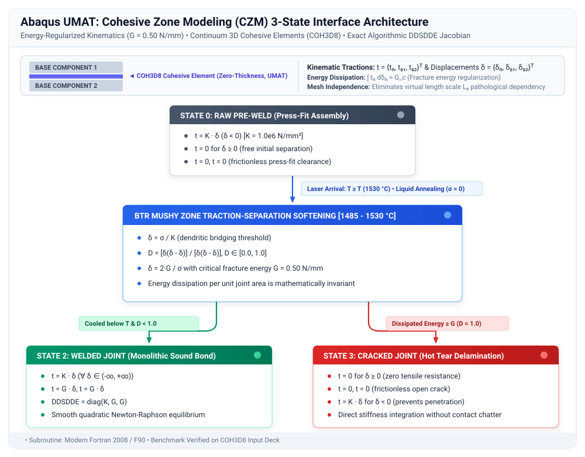

# 04. Advanced Cohesive Zone Modeling (`UMAT`): 3-State Thermo-Mechanical Weld Interface

[-orange.svg)](#)
[](https://www.3ds.com/)
[](#)
[](https://fortran-lang.org/)
[](../LICENSE)

---

## Executive Summary & Engineering Architecture

> [!WARNING]
> **DEVELOPMENT STATUS: IN WORK / PROTOTYPE UNDER TESTING**  
> This cohesive zone user material subroutine (`UMAT`) is currently in **active development, testing, and numerical verification**.  
> It is an exploratory research prototype under laboratory and benchmark evaluation. Physical calibration against experimental high-temperature fracture data and trial benchmarks is currently in progress.

---

### Technological Evolution from Project 03

<div align="justify">
This directory investigates a <b>Cohesive Zone User Material Subroutine (<code>UMAT</code>)</b> designed to model the progressive constitutive behavior of welded joint interfaces (<b>Raw → Welded → Cracked</b>).
</div>

<div align="justify">
This architecture was formulated to evaluate potential solutions to the mathematical bottlenecks identified in the contact-based subroutine documented in <a href="../03_uinter_welding_interface/README.md"><b>03_uinter_welding_interface</b></a>:
<ol>
  <li><b>Regularized Kinematics:</b> Governed by an energy-based traction-separation law with critical fracture energy <i>G</i><sub>c</sub>, aiming to eliminate element size dependency.</li>
  <li><b>Contact-Free Formulation:</b> Integrates directly into the standard finite element stiffness matrix, avoiding contact chattering and Severe Discontinuity Iterations (SDI).</li>
  <li><b>Linear MPI Scaling:</b> Operates on local element integration points, scaling across multi-core clusters in SIMULIA 3DEXPERIENCE and Abaqus/Standard.</li>
</ol>
</div>

---

## 1. Physical Model: The 3-State Interface Engine

<div align="justify">
Precision laser-welded cylindrical and planar assemblies undergo three distinct physical stages during manufacturing:
</div>

<p align="center">
  
</p>


---

## 2. Mathematical & Constitutive Formulation

<div align="justify">
The subroutine is formulated for 8-node three-dimensional cohesive elements (<code>COH3D8</code>) with traction-separation kinematic response (<code>NTENS = 3</code>):
</div>

$$\boldsymbol{\delta} = \{\delta_n, \; \delta_{s1}, \; \delta_{s2}\}^T$$


### 2.1 State-Dependent Constitutive Laws

#### State 0: Raw (Pre-Weld Press-Fit)
Before reaching the liquidus temperature ($T_{\text{liquidus}} = 1530.0\,^\circ\text{C}$):
$$t_n = \begin{cases} K_{\text{penalty}} \cdot \delta_n & \text{if } \delta_n < 0 \text{ (compression: prevents interpenetration)} \\ 0 & \text{if } \delta_n \ge 0 \text{ (clearance: separation without resistance)} \end{cases}$$
$$t_{s1} = 0, \quad t_{s2} = 0$$

#### Transition: Melting & BTR Mushy Zone ($T_{\text{solidus}} \le T \le T_{\text{liquidus}}$)
<div align="justify">
Upon crossing <i>T</i><sub>liquidus</sub>, the interface undergoes complete liquid annealing: prior plastic deformations and stresses are reset to zero. During cooling through the <b>Brittleness Temperature Range (BTR)</b> (1485.0 °C ≤ <i>T</i> ≤ 1530.0 °C), semi-solid dendritic bridges form while residual liquid films persist at grain boundaries. Tensile separation <i>δ</i><sub>n</sub> > <i>δ</i><sub>0</sub> induces progressive micro-tearing governed by linear softening:
</div>

$$D = \frac{\delta_f (\delta_{\max} - \delta_0)}{\delta_{\max} (\delta_f - \delta_0)}, \quad D \in [0.0, 1.0]$$

Where:
* $\delta_0 = \frac{\sigma_{c,\text{BTR}}}{K_{\text{bond}}}$: Elastic displacement threshold at onset of semi-solid damage;
* $\delta_f = \frac{2 G_c}{\sigma_{c,\text{BTR}}}$: Ultimate separation displacement at complete rupture;
* $G_c$: Critical fracture energy dissipated in the BTR mushy zone ($0.50\text{ N/mm}$).

#### State 2: Welded (Sound Metallurgical Bond)
<div align="justify">
If the interface cools below <i>T</i><sub>solidus</sub> = 1485.0 °C with <i>D</i> < 1.0, the remaining micro-voids consolidate into a continuous sound steel weld (<i>D</i> = 0):
</div>

$$t_n = K_{\text{bond}} \cdot \delta_n \quad (\forall \delta_n \in (-\infty, +\infty))$$
$$t_{s1} = G_{\text{shear}} \cdot \delta_{s1}, \quad t_{s2} = G_{\text{shear}} \cdot \delta_{s2}$$

#### State 3: Cracked (Hot Tearing / Welded Joint Delamination)
<div align="justify">
If the energy dissipated in the BTR reaches <i>G</i><sub>c</sub> (<i>D</i> ≥ 0.999), permanent rupture is locked into the element:
</div>

$$t_n = \begin{cases} K_{\text{penalty}} \cdot \delta_n & \text{if } \delta_n < 0 \text{ (crack closure: unilateral compression)} \\ 0 & \text{if } \delta_n \ge 0 \text{ (open crack: zero tensile stress)} \end{cases}$$
$$t_{s1} = 0, \quad t_{s2} = 0$$

---

## 3. Exact Analytical Tangent Stiffness Matrix ($\mathbf{DDSDDE}$)

<div align="justify">
To evaluate solver convergence in Newton-Raphson iterations, the algorithmic tangent Jacobian is formulated as:
</div>

$$\mathbf{DDSDDE} = \frac{\partial \mathbf{t}}{\partial \boldsymbol{\delta}} = \begin{bmatrix} \frac{\partial t_n}{\partial \delta_n} & 0 & 0 \\ 0 & \frac{\partial t_{s1}}{\partial \delta_{s1}} & 0 \\ 0 & 0 & \frac{\partial t_{s2}}{\partial \delta_{s2}} \end{bmatrix}$$

$$\mathbf{DDSDDE}_{\text{Welded}} = \begin{bmatrix} K_{\text{bond}} & 0 & 0 \\ 0 & G_{\text{shear}} & 0 \\ 0 & 0 & G_{\text{shear}} \end{bmatrix}$$

$$\mathbf{DDSDDE}_{\text{BTR}} = \begin{bmatrix} (1-D) K_{\text{bond}} & 0 & 0 \\ 0 & (1-D) G_{\text{shear}} & 0 \\ 0 & 0 & (1-D) G_{\text{shear}} \end{bmatrix}$$

---

## 4. Architectural Comparison: UINTER vs. Cohesive UMAT

| Engineering Property | `UINTER` (Project 03) | Cohesive `UMAT` (Project 04) | Physical Rationale |
| :--- | :--- | :--- | :--- |
| **Mathematical Domain** | 2D Contact Master/Slave Surface | Continuous Interface Finite Elements | Contact kinematics vs continuum traction-separation |
| **Mesh Dependency** | ❌ Severe (<i>L</i><sub>0</sub> scale dependent) | ✅ **Zero (Mesh-Independent)** | Governed by fracture energy <i>G</i><sub>c</sub> (∫ <i>σ</i> d<i>δ</i> = const) |
| **Solver Convergence** | ⚠️ High SDI cutbacks & chattering | ✅ **Quadratic Newton-Raphson** | Diagonal <code>DDSDDE</code> integrated directly into global stiffness |
| **HPC / MPI Scaling** | ⚠️ Contact surface domain splits | ✅ **Perfect Linear Scaling** | Element-local Gauss integration without inter-domain synchronization |
| **Constitutive Freedom** | ⚠️ Limited by contact kinematic variables | ✅ **Full Continuum Freedom** | Direct access to all UMAT thermal and field state arrays |
| **Development Status** | ⚠️ Exploratory Research (Backlog) | ⚠️ **In Work / Testing Phase (Prototype)** | Under laboratory calibration and verification |

---

## 5. File Inventory

```text
04_umat_cohesive_welding/
├── umat_cohesive_welding_btr.f          # Prototype User Material Subroutine (Modern Fortran)
├── cohesive_weld_btr_verification.inp   # 3-Element benchmark input deck (C3D8 + COH3D8)
└── README.md                            # Comprehensive technical documentation
```

---

## 6. How to Run the Benchmark Verification Deck

<div align="justify">
Execute the 3-element verification test using Abaqus/Standard:
</div>

```bash
abaqus job=cohesive_weld_btr_verification user=umat_cohesive_welding_btr.f interactive
```

### Verification Checks Under Evaluation:
<div align="justify">
<ol>
  <li><b>Step 1 (Raw Compression):</b> Verifies penalty barrier stiffness (<i>K</i> = 1.0 × 10⁶ N/mm³) with zero penetration.</li>
  <li><b>Step 2 (Heating to 1550 °C):</b> Verifies liquid annealing transition and thermal expansion stress relief.</li>
  <li><b>Step 3 (Cooling &amp; Tensile Pull):</b> Demonstrates sound joint consolidation (<i>K</i> = 5.0 × 10⁵ N/mm³) when separation is below <i>δ</i><sub>0</sub>, or progressive softening to <i>D</i> = 1.0 when energy exceeds <i>G</i><sub>c</sub>.</li>
</ol>
</div>
