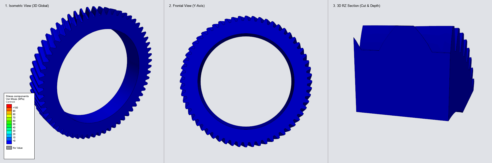
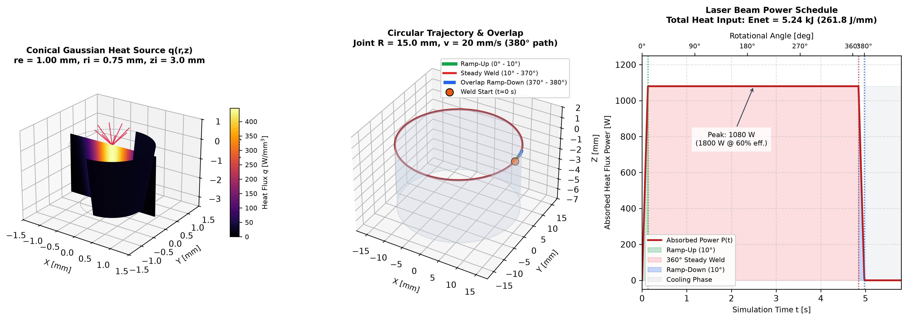

# Advanced Abaqus User Subroutines Portfolio

A repository of production-grade user subroutines for **Abaqus/Standard** and **3DEXPERIENCE SIMULIA**, written in **Fortran** for high-performance structural, fatigue, and manufacturing simulations.

---

## Portfolio Projects & Subroutine Implementations

| ID | Subroutine | Physics / Type | Engineering Application | Status |
| :---: | :--- | :--- | :--- | :---: |
| **01** | [`DLOAD`](01_dload_gear_fatigue/README.md) | Moving Surface Load / Quasi-Static | High-cycle fatigue analysis of a welded helical crown gear (360° full revolution) | ✅ Verified |
| **02** | [`DFLUX`](02_dflux_laser_welding/README.md) | Moving Conical Flux / Thermo-Mechanical | Sequentially coupled laser welding with phase transformations and residual stress | ✅ Verified |

---

### Project Showcase: 01. Helical Crown Gear Fatigue (`DLOAD`)

[](01_dload_gear_fatigue/README.md)
[](01_dload_gear_fatigue/README.md)
[](01_dload_gear_fatigue/README.md)

<p align="center">
  <a href="01_dload_gear_fatigue/README.md">
    
  </a>
</p>

*Analytical multi-viewport simulation across all 60 teeth of a heavy-duty automotive helical crown gear ($T = 270\text{ N}\cdot\text{m}$, $z = 60$, $\beta = 25^\circ$), featuring 3D European isometric projection, Y-axis frontal view, and transverse 3D RZ section.*

#### Key Simulation & Fatigue Results:
- **Peak Tensile Bending:** $\sigma_{\max} = 68.13\text{ MPa}$ at **Frame 55** ($t = 1.100\text{ s}$, Increment 550) in tooth root fillet.
- **Out-of-Mesh Valley:** $\sigma_{\min} = 0.00\text{ MPa}$ at **Frame 30** ($t = 0.600\text{ s}$, Increment 300), $180^\circ$ out of phase.
- **Cyclic Stress Amplitude:** $\sigma_a = 34.07\text{ MPa}$ (pulsating ratio $R = 0$, Goodman equivalent $\sigma_{a,\text{eq}} = 35.50\text{ MPa}$).
- **Fatigue Life Regime:** **Infinite Life / High-Cycle Fatigue ($N > 10^7$ cycles)** with structural safety factor $SF_F \approx 7.0$ ($S_e \approx 250\text{ MPa}$).

Detailed formulation, kinematic equations, FEA verification, and post-processing scripts are available in [01_dload_gear_fatigue/](01_dload_gear_fatigue/README.md).

---

### Project Showcase: 02. Circumferential Laser Welding (`DFLUX`)

[](02_dflux_laser_welding/README.md)
[](02_dflux_laser_welding/README.md)
[](02_dflux_laser_welding/README.md)

<p align="center">
  <a href="02_dflux_laser_welding/README.md">
    
  </a>
</p>

*Sequentially coupled thermo-mechanical analysis of circumferential laser welding ($R = 15\text{ mm}$, $P_{\text{abs}} = 1080\text{ W}$, $v = 1200\text{ mm/min}$) with moving conical Gaussian heat source, metallurgical phase transformations (`ABQ_PHASE_TRANS`), hybrid elements (`C3D8H`), continuous annealing at $1500^\circ\text{C}$, and residual stress prediction for 16MnCr5 case-hardening steel.*

#### Key Thermal, Metallurgical & Mechanical Highlights:
- **3D Conical Gaussian Heat Source:** Analytically normalized peak flux $Q_0 = 405.5\text{ W/mm}^3$ with $10^\circ$ linear power ramp-up, $360^\circ$ steady weld, and $10^\circ$ crater-filling ramp-down overlap.
- **Pre-Solver Numerical Verification:** $2 \times 2 \times 2$ Gauss quadrature integration across the 67,392 elements of the irradiated domain confirms $98.12\%$ energy conservation on the discrete mesh.
- **Metallurgical Kinetics & Solidification (BTR):** Tracks liquidus/solidus melt pool kinetics and solid-state phase decomposition (Ferrite-Pearlite, Austenite, Bainite, Martensite via JMA and Koistinen-Marburger kinetics).
- **Sequentially Coupled Structural Analysis:** Mitigates high-temperature volumetric locking via hybrid formulation elements (`C3D8H`), hydrostatic gravity stabilization, and line search non-linear controls.

Detailed formulation, verification routines, simulation input decks, and automated post-processing pipeline are available in [02_dflux_laser_welding/](02_dflux_laser_welding/README.md).

---

## Directory Layout

```text
.
├── 01_dload_gear_fatigue/
│   ├── DLOAD_CROWN_HELICAL.f      # User Subroutine (Modern Fortran DLOAD + UEXTERNALDB)
│   ├── Gear_torque.inp            # Master Input Deck
│   ├── GEOMETRY_GEAR.inp          # 3D Finite Element Mesh & Topology
│   ├── gear_torque_simulation.gif # Full 360-degree multi-viewport animation
│   ├── compile_vtk_to_gif.py      # Multi-viewport visualization compiler
│   ├── odb_to_vtk.py              # Abaqus Python ODB to VTK extractor
│   ├── run_pipeline.sh            # Headless Linux / HPC batch execution script
│   └── README.md                  # Comprehensive Technical Report
├── 02_dflux_laser_welding/
│   ├── DFLUX.f                    # User Subroutine (Modern Fortran Conical Heat Source)
│   ├── DFLUX.for                  # User Subroutine Fallback (Fixed-Form Fortran 77)
│   ├── GLOBAL_THERM.inp           # Master Thermal Analysis Deck (DC3D8)
│   ├── GEOMETRY_THERM.inp         # High-Density Thermal Mesh Deck (DC3D8)
│   ├── MATERIAL_16MnCr5.inp       # Phase Transformation Material Properties (ABQ_PHASE_TRANS)
│   ├── GLOBAL_MECH.inp            # Master Mechanical Analysis Deck (C3D8H)
│   ├── GEOMETRY_MECH.inp          # Structural Hybrid Mesh Deck (C3D8H, NSET_BASE)
│   ├── MATERIAL_16MnCr5_MECH.inp  # Temperature-Dependent Elasto-Plastic & Annealing Properties
│   ├── odb_to_vtk.py              # Abaqus Python ODB to VTK Extractor & ZIP Bundler
│   ├── compile_vtk_to_gif.py      # Multi-Viewport Animated Report Compiler
│   ├── run_pipeline.sh            # Headless Linux / HPC Batch Execution Script
│   ├── verify_model.py            # Standalone Gauss Energy Conservation Verifier
│   ├── docs/                      # 3D Heat Source Verification Figures
│   └── README.md                  # Comprehensive Technical Report
├── LICENSE
└── README.md
```

---

## Author & Contact

**Victor Maia**  
- **Email:** [vhfm08@gmail.com](mailto:vhfm08@gmail.com)  
- **GitHub:** [@vhfmaia](https://github.com/vhfmaia)  
- **Specialization:** Advanced Abaqus User Subroutines (`UMAT`, `VUMAT`, `DLOAD`, `DFLUX`, `DISP`, `USDFLD`, `HETVAL`) & FEA Simulation Automation
